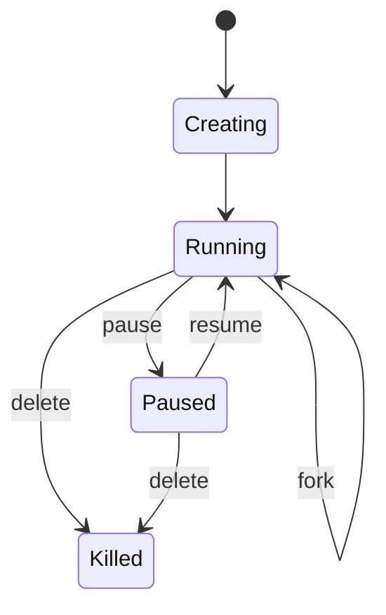

# AgentENV：Template、Sandbox、Snapshot 生命周期

> 调研日期：2026-08-31  
> 范围：AgentENV 官方 `latest` 文档、GitHub `kvcache-ai/AgentENV` 主仓库与 Releases。  
> 版本提示：当前 GitHub 最新 tagged release 为 `v0.1.2`；`main` 分支 Rust workspace 已为 `0.1.3`。`latest/main` 中的内容不一定全部包含在 v0.1.2 二进制发布中。

## 1. 三个核心对象

```text
OCI Image / Dockerfile
        ↓
     Template
        ↓ start
     Sandbox
        ↓ snapshot
     Snapshot
        ↓ start / fork
  New Sandbox(es)
```

Template 是可复用环境定义；Sandbox 是运行/暂停中的 microVM；Snapshot 是某个 Sandbox 的可复用 checkpoint。

## 2. Template Pull

```bash
aenv pull ubuntu:24.04
```

可关联 name、CPU、memory、start command、ready command/probe、timeout 等。

## 3. Dockerfile Builder

支持核心指令：

```text
FROM RUN ENV ARG WORKDIR USER ENTRYPOINT CMD
```

`EXPOSE`、`VOLUME`、`LABEL` 等主要作为 metadata。OCI Config 可识别 Env、WorkingDir、User、Entrypoint/Cmd、ExposedPorts、Volumes。

不应假定与完整 Docker BuildKit 100% 语义一致。

## 4. 生命周期



## 5. Warm Start

```bash
aenv start <template-or-snapshot>
```

常见参数：`--secure`、`--timeout`、`--detach`。

Warm start 资源通常继承 Template/Snapshot。

## 6. Cold Start

```bash
aenv start --cold ubuntu:24.04
```

Cold start 可明确设置 CPU/memory/disk。当前 CLI 文档对 disk size 有最小值/对齐约束，实际以对应版本 `aenv start --help` 为准。

## 7. Connect / Exec

```bash
aenv connect <sandbox-id>
aenv cn <sandbox-id>
aenv exec <sandbox-id> -- bash -lc 'python --version'
```

连接已 Pause 的 Sandbox 可以触发自动 resume。

## 8. Upload 限制

目录 upload 不完整保留：

- ownership/group；
- permissions/executable bits；
- timestamps；
- ACL/xattrs；
- hard links。

symlink/特殊文件也有限制。严格 POSIX 场景建议 tar、git clone 或预构建进 Template。

## 9. TTL / Timeout

- `autoPause=true`：到期 Pause
- `autoPause=false`：到期 Delete

用于自动回收 Agent 临时环境。

## 10. Snapshot

```bash
aenv snapshot create <sandbox-id>
```

可保存/继承：

- filesystem；
- running processes；
- VM memory；
- environment；
- runtime config；
- machine resources。

源 Sandbox 创建 Snapshot 后可继续运行。

## 11. 增量 Snapshot

```text
disk:
base → snapshot layer1 → layer2 → live upper

memory:
base memory → dirty delta1 → dirty delta2
```

只保存变化部分，适合 RL/benchmark 大量分支。

## 12. Fork

```text
      State S
      / |  \
    A   B   C
```

用于 rollout、搜索树、分支探索、并行 trial。

## 13. Snapshot 发布为 OCI

rootfs 可配置发布成 OCI Image；VM memory/state 仍保存在 Snapshot Repository。典型 tag 类似：

```text
agentenv-snapshot-<snapshot-id>
```

## 14. 常见生命周期模式

```text
Ephemeral: start → execute → collect → delete
Session:   start → work → pause → resume
Reset:     base snapshot → trial → delete → repeat
Branch:    state → fork A/B/C → evaluate
```

## 官方来源

- https://kvcache-ai.github.io/AgentENV/latest/
- https://github.com/kvcache-ai/AgentENV/tree/main/src/template
- https://github.com/kvcache-ai/AgentENV/tree/main/src/snapshot
- https://github.com/kvcache-ai/AgentENV/tree/main/src/sandbox
