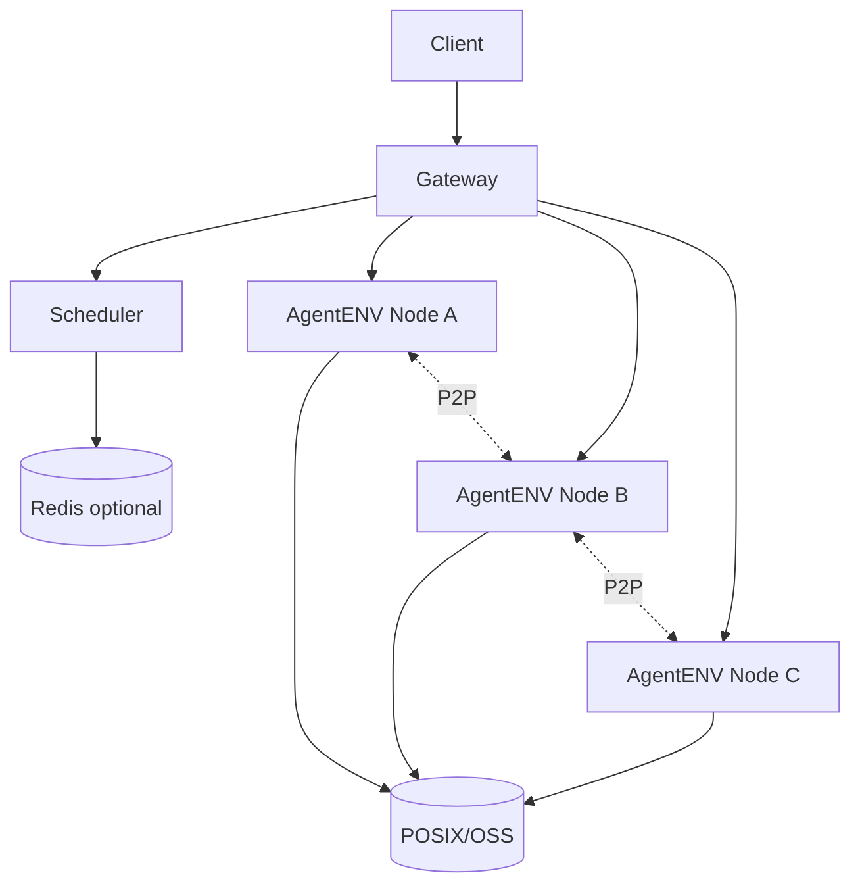

# AgentENV：分布式控制面、调度、Redis 与 P2P

> 调研日期：2026-08-31  
> 范围：AgentENV 官方 `latest` 文档、GitHub 主仓库与 Releases。  
> 版本提示：tagged release 与 `main/latest` 请分开理解。

## 1. 为什么还需要 AgentENV Scheduler

Kubernetes 看到的是 AgentENV Node Pod，不知道 Node 内每一个 Firecracker Sandbox。

AgentENV 自己维护：

```text
Sandbox placement
Sandbox → Node binding
Node health/resources
Gateway routing
Artifact peer discovery
```

## 2. `services/`

分布式控制面位于：

```text
services/
```

使用 Go。

当前 main `services/go.mod` 声明 Go 1.25.0；旧文档可能仍写 1.21+。构建时应以固定 tag 的 `go.mod` 为准。

## 3. Gateway

职责：

- 统一 HTTP API；
- 新 Sandbox 调度；
- binding lookup；
- HTTP/WebSocket forwarding；
- 聚合全局查询。

创建：

```text
Client
→ Gateway
→ Scheduler.Schedule
→ selected Node
→ create Sandbox
→ persist binding
```

后续请求：

```text
sandbox-id
→ binding
→ target Node
→ forward
```

## 4. Scheduler

通过 gRPC 工作。

职责：

- node discovery；
- heartbeat/health；
- scheduling；
- sandbox binding；
- observed state；
- artifact provider discovery；
- resource filtering。

当前公开策略包括：

- `round_robin`
- `random`

## 5. Node Discovery

### Static

配置固定 Node 地址。简单，但动态性弱。

### Kubernetes EndpointSlice

由 K8s 动态发现 AgentENV Nodes，适合 DaemonSet。

## 6. Binding Store

```text
sandbox-id → node-id
```

支持：

- memory；
- Redis。

Redis 适合多个 Gateway/control-plane 进程共享路由状态。

## 7. Query-only Replica / Resource Filter

服务设计中还包括 query-only replica 与通用 node resource limit/filter 机制，用于扩展查询与根据 Node metrics 排除资源不足节点。

具体 HA/一致性行为需以对应 release 实现为准。

## 8. P2P Artifact Transport

路径：

```text
src/p2p/
```

当前 Experimental，首个 backend 基于：

- iroh；
- iroh-blobs。

## 9. P2P 目的

无 P2P：

```text
Node A → Central Store
Node B → Central Store
Node C → Central Store
```

有 P2P：

```text
Node A already has artifact
      ↓
Scheduler returns provider
      ↓
Node B fetches from Node A
```

减少热点 Artifact 对中心存储的重复读取。

## 10. Scheduler 不传 Artifact 数据

Scheduler 只负责：

```text
artifact key → providers/endpoints
```

真正的数据传输是 Node ↔ Node。Scheduler 不是数据 Proxy。

## 11. Backend-neutral

调度协议通过 descriptor/provider/backend locator 描述 Artifact，不把控制面完全绑定到 iroh，便于未来替换传输后端。

## 12. 故障场景

### Node Down

binding 可能指向失效 Node，需要 health/reconciliation。

### Scheduler Down

新 Sandbox placement 受影响。

### Redis Down

使用 Redis binding 时，路由/创建可能受影响。

### Object Store Down

热缓存环境可能还能工作，cold miss/snapshot start 会受影响。

### P2P Provider Stale

应具备回退 central store 的策略。

## 13. Kubernetes 拓扑



## 14. 大规模生产仍要重点验证

```text
Scheduler HA
binding consistency
node drain
rolling upgrade
tenant quota
fair scheduling
admission control
failure-domain awareness
snapshot locality
Redis HA
Gateway autoscaling
distributed tracing
```

## 官方来源

- https://kvcache-ai.github.io/AgentENV/latest/
- https://github.com/kvcache-ai/AgentENV/tree/main/services
- https://github.com/kvcache-ai/AgentENV/tree/main/src/p2p
