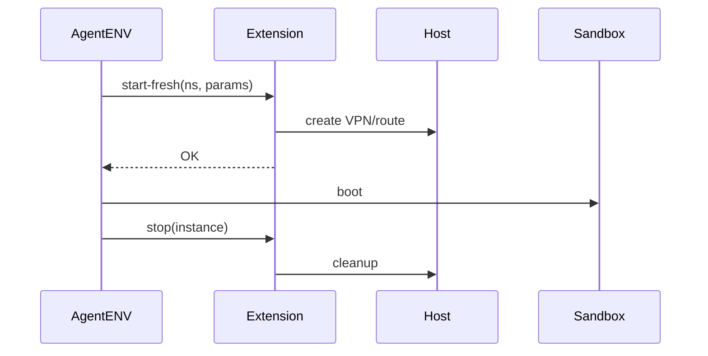

# AgentENV：Custom Extension 扩展机制

> 调研日期：2026-08-31  
> 范围：AgentENV 官方 `latest` 文档、GitHub 主仓库与 Releases。  
> 版本提示：tagged release 与 `main/latest` 请分开理解。

## 1. 定位

Custom Extension 是 AgentENV 的外部 Sandbox 生命周期 Hook。

它允许企业在不直接修改 AgentENV Core 的情况下，把 Host 网络、VPN、挂载、安全策略等私有基础设施接入 Sandbox 生命周期。

## 2. Hook 类型

当前设计包括：

```text
start-fresh
start-resume
patch-params
stop
```

通过类似：

```text
POST /sandbox-hook
```

调用外部 HTTP Service。

## 3. start-fresh

新 Sandbox 首次启动时调用。

信息可包括：

```text
sandboxId
sandboxInstanceId
networkNamespacePath
hostInteractionIp
customExtensionParams
```

Extension 可以准备：

- VPN；
- route；
- firewall；
- host-side mount；
- tracing；
- 外部 lease/resource。

响应还可附加 boot args 等扩展内容。

## 4. start-resume

Paused/Snapshot 环境恢复时调用，用于重新建立 Host-side 的临时网络/挂载/策略。

## 5. patch-params

用于校验、修改、补全业务传入的 Custom Extension 参数。

例如：

```json
{
  "tenant": "team-a",
  "vpn": "corp"
}
```

可经企业 Policy Service 转换后再用于真正启动。

## 6. stop

Sandbox 停止时清理：

```text
VPN
route
firewall
mount
temporary credential
external lease
```

stop 更偏 best-effort，避免外部 Extension 故障把核心资源永久卡住。

## 7. Failure Semantics

- start/patch 失败：对应 Sandbox 核心操作失败；
- stop 失败：清理通常 best-effort。

这是合理的生命周期语义：

```text
创建阶段必须正确
清理阶段必须可最终收敛
```

## 8. Instance Identity

需要区分：

```text
sandboxId
sandboxInstanceId
```

同一逻辑 Sandbox 在恢复/重新实例化过程中，运行实例可能变化。异步 start/stop 还可能乱序，所以 Extension 必须实现幂等与 instance 校验。

## 9. 参数持久化

Custom Extension Params 可随 pause/resume 和 Snapshot 保持，用于恢复一致策略。

## 10. 配置

```toml
[custom_extension]
url = "http://extension-service:..."
timeout = ...
```

或：

```bash
AENV_CUSTOM_EXTENSION_URL=...
```

## 11. 企业 VPN 示例



## 12. 安全要求

Custom Extension 本质是高权限 Host Hook：

- 必须可信网络；
- 自身鉴权；
- schema validation；
- sandbox/instance 校验；
- 幂等；
- timeout/retry；
- audit；
- 不执行任意用户 shell；
- 不允许任意 Host path；
- stop 支持重复执行；
- 最好有 reconciliation。

## 13. 设计价值

这是一种典型的 Infra 扩展模式：

```text
generic core
+ stable lifecycle hook
+ external policy/integration
+ explicit failure semantics
+ instance identity
```

比长期 fork AgentENV Core 更利于升级。

## 官方来源

- https://kvcache-ai.github.io/AgentENV/latest/
- https://github.com/kvcache-ai/AgentENV/tree/main/src/custom_extension_api
