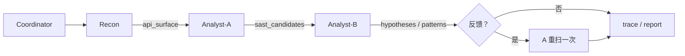

# 漏洞扫描项目

## 一、主流程总览

### 1.1 `run_pipeline.py`：精确覆盖与固定 PoC 验证


主流程先用三层 Recon 过滤把 `634` 个内核文件收敛为 `98` 个扫描文件，再用SAST 产生 `1592` 条候选漏洞。随后 `EXPECTED` 只核验 6 个指定目标是否被命中，`CVE_POC` 再运行对应的 6 个预置 PoC。结果为 `6/6` 扫描覆盖、`6` 条代码级确认。优势是定位和验证链路清楚.

### 1.2 多智能体：广泛测绘与候选优先级排序



多智能体由 Coordinator 顺序调度 Recon、Analyst-A、Analyst-B，并通过 Blackboard 传递文件清单、正则候选和高置信假设。Recon 负责扩大攻击面测绘，Analyst-A 负责规则广筛，Analyst-B 负责守卫、可达性、差分和评分，从而决定哪些候选优先复核。它的优势是分工清楚、过程可追溯，并可加入 LLM 作为可选的守卫判断辅助.

### 1.3关键概念速览

| 概念 | 含义 | 作用 |
|---|---|---|
| SAST | 静态应用安全测试；不运行程序，直接分析源码 | 从代码结构中找风险候选 |
| AST | 抽象语法树；把源码解析成“函数、运算、调用、指针访问”等结构 | 让扫描器识别真正的代码，而不是误读注释或字符串 |
| 污染分析 | 跟踪一个值是否可能来自外部输入 | 判断除数、索引、尺寸是否可被攻击者控制 |
| CWE | 通用漏洞根因分类 | 给候选标注除零、空指针、越界等类型 |
| PoC | 最小可复现测试 | 用一组输入证明候选路径是否能被触达 |
| DAST | 动态安全测试 | 运行程序，观察输入造成的实际行为 |
| Fuzz | 模糊测试 | 自动变异边界输入，寻找额外异常 |

## 二、Recon：三层过滤得到攻击面

**对应代码**：`result/run_pipeline.py::recon()`。

### 2.1 输入和输出

Recon 读取代码库中的三个目录：

| 模块 | 目录 | 关注原因 |
|---|---|---|
| 端侧推理内核 | `tensorflow/lite/kernels/` | 解析恶意模型和张量 |
| 编译器/XLA 算子 | `tensorflow/compiler/tf2xla/kernels/` | 处理用户计算图和动态形状 |
| 核心内核 | `tensorflow/core/kernels/`，另处理 `mkl/` | 执行公共算子、稀疏和量化计算 |

**输出：**文件二元组“模块名 + 文件路径”。Recon 只回答“哪些文件值得扫”，不判断是否存在漏洞。

### 2.2 单个文件的三层正则过滤

三层过滤都使用 Python `re.compile()` 预先编译正则表达式，再对每个文件执行匹配。三层是 **AND（并且）** 关系，任意一层失败就跳过文件。

| 层级 | 正则名称 | 检查范围 | 通过含义 |
|---|---|---|---|
| 第 1 层：内核标记 | `KERNEL_MARKERS` | 文件前 8192 个字符 | 有 `Prepare`、`Compute`、`Eval`、`OpKernel`、`REGISTER_OP` 等执行标记 |
| 第 2 层：风险模式 | `RISKY` | 文件全文 | 有 `dims->data`、`GetTensorData`、`->matrix`、`->flat`、`xla::Shape` 等数据访问 |
| 第 3 层：算子家族 | `OP_FAMILY` | 文件名 | 有 `conv`、`audio`、`sparse`、`quant`、`tensor_list`、`matmul` 等类型词 |

最终判断：`KERNEL_MARKERS 匹配` 且 `RISKY 匹配` 且 `OP_FAMILY 匹配`。通过后加入 `surface`；Recon 不使用具体漏洞文件名或行号。

执行结果：第一层得到 `634` 个带内核标记的文件；第二层和第三层组合过滤后，`surface` 中保留 `98` 个 `.cc` 文件。98 是 SAST 的输入文件数量，不是漏洞数量。

## 三、SAST：规则如何产生候选

**对应代码**：`work/skills/vulnerability-discovery/scripts/ast_sast_scanner.py`。

扫描器使用 tree-sitter 解析 C++ AST，再按函数建立污染变量表：函数参数、函数调用结果、数组下标、成员读取和出参写入都视为可能受外部输入影响，后续赋值继续传递这个标记。之后逐个检查危险操作；只有“危险值可能被外部控制”且“操作前没有对应守卫”时，才生成候选。

| 规则 | CWE/概念 | 检查对象 | 什么时候记录候选 |
|---|---|---|---|
| R1 | CWE-369 除零 | 除法、取模的除数 | 除数不是常量、可能被污染，且之前没有同变量的非零/正数检查 |
| R2 | CWE-476 空指针 | `data`、`matrix`、`flat`、`buffer` 等数据访问 | 指针来自参数或 getter，解引用前没有空值检查；安全 getter 默认排除 |
| R3 | CWE-1284 零维/尺寸缺失 | 维度、形状、长度、通道数用于创建、分配或读取 | 使用前没有大于零、至少为一或不等于零检查 |
| R4 | CWE-416 使用已释放内存 | 释放后的对象 | 同一函数中释放后再次使用，中间没有重新赋值 |
| R5 | CWE-125 越界读取 | 外部索引和数组访问 | 索引受污染、不是普通循环计数器，且没有边界守卫 |
| R6 | CWE-190 整数溢出分配 | 多个可控值相乘后分配内存 | 没有安全乘法或最大值保护 |

每次命中保存规则、CWE、文件、函数、行号、片段和上下文，汇总为 `sast_candidates`。候选只表示代码形状可疑，不表示漏洞已经确认。

执行结果：SAST 扫描 98 个文件得到 `1592` 条候选，分布为 R1 78 条、R2 954 条、R3 467 条、R5 93 条。一个文件可有多条候选，因此候选数大于文件数是正常现象。

## 四、候选如何变成最终漏洞

**对应代码**：`result/run_pipeline.py::sast_discover()`、`CVE_POC`、`run_pocs_parallel()`。

| 阶段 | 程序实际做什么 | 输入 | 输出 |
|---|---|---|---|
| 1. 广筛 | 对 98 个文件执行 SAST 六条规则 | 98 个 `.cc` 文件 | 1592 条 `cands` |
| 2. 覆盖核验 | 逐条读取 `EXPECTED` 中的 6 个目标，检查 `cands` 中是否存在“同文件 + 同规则 + 同函数范围或近似行号”的候选 | 1592 条 `cands` + 6 个 `EXPECTED` 目标 | `discovered`：6 个命中/漏报状态 |
| 3. 选择 PoC | 从预先定义的 `CVE_POC` 映射中，取出这 6 个目标对应的 PoC 文件 | 6 个目标标识 | 6 个固定 PoC 脚本 |
| 4. 动态验证 | 并行运行每个 PoC 的 CONTROL 和 TRIGGER | 6 个 PoC | 每条的 `PROVEN`、代码级确认或 FAIL |
| 5. 汇总 | 统计 SAST 命中数和 PoC 通过数，写 `pipeline_summary.json` | 6 个扫描核验结果 + 6 个 PoC 结果 | 最终报告统计 |

`EXPECTED` 的作用只是“扫描器是否命中这 6 个评测目标”的测试基准，它**不参与** Recon 或 SAST 的匹配。`CVE_POC` 的作用是“目标到 PoC 文件”的固定映射。

因此当前主入口的真实关系是：

```text
1592 条候选
  -> EXPECTED 核验其中是否覆盖 6 个指定目标
  -> 为这 6 个目标运行预先准备的 6 个 PoC
  -> 输出这 6 个目标的验证结论
```

这不是“程序自动从 1592 条候选中筛出 6 条真实漏洞并自动生成 PoC”。其余候选仍需要额外的源码复核、可达性判断和 PoC 生成；`auto_exploiter.py` 是独立探索脚本。

本次结果：6 个 `EXPECTED` 目标均被 SAST 命中，即 `6/6`；6 个预置 PoC 均完成代码级确认。

## 五、PoC 与 Validator：如何给出证据等级

### 5.1 单个 PoC 

| 步骤 | 输入/动作 | 程序观察什么 |
|---|---|---|
| 1. CONTROL | 合法张量、尺寸或参数 | API 能正常执行，作为对照基线 |
| 2. TRIGGER | 针对源码缺陷构造边界输入，如除数为 0、负尺寸、空参数 | 是否进入目标函数，以及产生什么异常/信号 |

这里的PoC 是“固定验证集回放”：SAST 负责证明能从源码命中目标，PoC 负责证明目标 API 能否被特定输入触达，用于验证已知目标。

### 5.2 Validator 的机械判定顺序

`new/result/run_all.py` 不看“进程退出码为 0”就判通过，只识别 PoC 输出的标准标记；`poc_common.verdict` 按以下顺序判断：

```text
CONTROL 对照 + TRIGGER 触发
        ↓
原生信号？──是──> PROVEN
        │否
目标 marker 命中且 CONTROL 未同样命中？──是──> 代码级确认
        │否
变异 Fuzz 无新崩溃？──是──> NEGATIVE
        │否
       FAIL
```

**结果：**当前 Python TensorFlow 运行库已经包含历史修复，因此 6 个 CVE PoC 的 TRIGGER 进入了目标路径后被守卫异常拦截，结果是 `6 条代码级确认`；额外的变异 Fuzz 没有新崩溃，结果是 `1 条 NEGATIVE`。没有捕获原生信号，所以 `PROVEN=0`，不能写成“6 条 PROVEN”。只有把对应未修复源码构建成实际运行库，并由 TRIGGER 捕获原生信号，才可把相应条目升级为 `PROVEN`。

## 六、多智能体

**入口**：`new/work/skills/vulnerability-discovery/scripts/coordinator.py`

```
                     ┌─────────────── 共享黑板 Blackboard ────────────┐
                     │  api_surface / module_matrix / operators / sca     │
                     │  sast_candidates / sast_stats                      │
                     │  hypotheses / knowledge_base / trace / feedback   │
                     │  ┌──────┐   ┌──────────┐   ┌──────────┐   ┌─────┐ ┘
   code_root ───────► │ Recon │──►│ Analyst-A │──►│ Analyst-B │──►│ KB  │
                     └───────┘   └──────────┘   └──────────┘   └──┬──┘
                                                                  │ learned_patterns
                                                     ┌────────────┘
                                                     ▼ 反馈环（≤2 轮）
                                                Analyst-A 重扫
```

每次交接实际都先写入 Blackboard，再由下一 Agent 读取。Coordinator 只控制顺序、反馈和落盘

### 6.1 先理解三类组件

| 组件 | 只负责什么 | 不负责什么 |
|---|---|---|
| Coordinator | 固定顺序启动 Agent、判断是否反馈、保存日志和快照 | 不读源码、不判漏洞、不调用 LLM |
| Blackboard | 保存中间数据、记录 `trace`、用锁保护读写 | 不扫描源码、不计算评分、不生成漏洞结论 |
| Recon / Analyst-A / Analyst-B | 各自读取上游键，完成本阶段分析，再写入下游键 | 不直接调用其他 Agent |

**线性**：因为存在明确依赖：Recon 先给出文件，Analyst-A 才能扫描；A 先给出候选，Analyst-B 才能精筛；B 先写出学习模式，Coordinator 才能判断是否重扫。

### 6.2 三个 Agent 的输入、处理和输出

```text
代码库： 
  -> Recon：文件清单 api_surface
  -> Analyst-A：可疑代码行 sast_candidates
  -> Analyst-B：待验证假设 hypotheses
```

1. **ReconAgent：回答“哪些文件需要扫描？”**

**输入：**代码根目录，例如 `code/`。

**实际调用顺序（`api_discovery.py`）：**`run()` → `_observe()` → `_reason()` → `_act()` → `_learn()`。

**核心步骤：**

1. 用 Blackboard 的 `get()` 检查是否已有文件清单；有就结束，避免重复测绘。
2. 用 `pathlib.Path.glob()` 按 5 组预设源码模块路径查找非测试 `.cc` 文件；这里描述的是扫描范围，不是模型名称。
3. 用路径对象生成“模块名、相对路径、绝对路径”；再用正则提取算子注册名和 `WORKSPACE` 中的依赖名称。
4. 用 Blackboard 的 `publish()` 写入文件清单、模块统计、算子、依赖，并用 JSON 落盘为 `api_surface.json`。

**输出：**`api_surface`。例如 `tensorflow/lite/kernels/conv.cc` 只是其中一个“待扫描文件”。

**结果：**`api_surface` 共 `2536` 个 `.cc` 文件，其中端侧推理内核 `136`、编译器/XLA 算子 `1678`、核心内核 `718`、图像编解码 `3`、音频算子 `1`；额外提取 `1850` 个算子注册名，SCA 依赖结果为 `0`。这是多智能体的全量文件测绘结果，不是主流程三层过滤后的 `98` 个文件。

**阶段结论：**文件进入扫描范围，不表示文件存在漏洞。

**2. Analyst-A：回答“文件中哪些代码行可疑？”**

**输入：**Recon 写入的 `api_surface` 文件列表。

**实际调用顺序（`sast_scanner.py`）：**`run()` → `_observe()` → `_reason()` → `_act()` → `_learn()`。

**核心步骤：**

1. 用 Blackboard 的 `get()` 取出 Recon 给的文件清单；没有文件就结束。
2. 用 `set` 记录已见绝对路径，去掉重复文件。
3. 逐文件读取文本，逐行用 `re.search()` 匹配 10 条 CWE 规则。
4. 用局部代码窗口检查“危险表达式、风险来源、附近无守卫”三个条件；R1 再用正则排除常量除数。
5. 把命中行组装为字典记录，用 `publish()` 写入 Blackboard，并用 CSV 写入器落盘。这个 Agent 不会根据结果修改规则。

**输出：**`sast_candidates`。例如 `R3 / conv.cc:496 / filter->dims->data[3]` 的含义只是“这一行读取维度，符合零维风险规则”。

**这一阶段的结论：**它是正则候选，可能误报，不能直接称为漏洞。

**3. Analyst-B：回答“哪些候选优先复核？”**

**输入：**Analyst-A 写入的 `sast_candidates`。

**实际调用顺序（`analyst_semantic.py`）：**`run()` → `_observe()` → `_reason()` → `_act()` → `_learn()`。

**核心步骤：**

1. 用 Blackboard 的 `get()` 取出 Analyst-A 的候选；没有候选就结束。
2. 用规则白名单筛选 R1/R2/R3/R4/R5/R7，再用“规则+文件+行号”的元组去重，最多取 200 条。R6/R8/R9/R10 仍在候选表，只是不参与本阶段评分。
3. 截取候选附近 25 行文本；守卫判断使用 `LLMClient` 或关键词启发式，可达性使用关键词搜索，差分检查则在完整文件中搜索位宽、守卫和验证路径不一致。
4. 用固定加分模型排序：基础 `0.3`，无守卫 `+0.3`，可达性 `+0.2`，差分 `+0.2`；分数达到 `0.6` 才保留。
5. 用 `publish()` 写入待验证假设，并用 `learn_pattern()` 写入 `learned_patterns`，供 Coordinator 决定是否再扫描一次。

**输出：**`hypotheses`。如 `R3 / conv.cc / 置信度 0.7 / 零维 DoS` 表示“这个候选值得优先源码复核或写 PoC”。

**阶段结论：**分数是验证优先级，不是漏洞证明；`PROVEN` 只能由独立 PoC/Validator 捕获运行时原生信号后给出。

### 6.3 Blackboard 优势

1. **解耦**：每个 Agent 只需知道"从黑板读什么、往黑板写什么"，不需要知道上游是谁、下游是谁。这意味着 Agent 可独立开发、测试、替换——换掉 SAST 引擎（如从正则换成 AST）不需要改其他任何 Agent 的代码。
2. **可观测性**：所有中间结果都在黑板的 `_state` 字典里，`snapshot()` 一调即可 dump 全部状态。如果用函数传参，中间结果散落在各函数栈帧里，调试时根本看不到全局。黑板让"pipeline 跑完后，每一步产出了什么"变得完全透明。
3. **反馈环天然支持**：反馈环的本质是"下游的产出（learned_patterns）喂回上游重跑"。在黑板架构里，这只是 Analyst-A 再读一次黑板、再写一次——不需要改任何 Agent 的代码。

### 6.4 ReAct 作用

| ReAct 步骤 | 本项目中的实际行为 | 例：Analyst-B |
|---|---|---|
| Observe | 从黑板取上一阶段输出；没有输入则停止 | 读取 `sast_candidates` |
| Reason | 把输入变成待处理计划 | 过滤规则、去重并取前 200 条 |
| Act | 执行分析并写回黑板/文件 | 分析上下文后写 `hypotheses.json` |
| Learn | 将本轮可复用结果存为模式 | 把高置信假设写为 `learned_patterns` |

ReAct 是本地的状态机循环，不需要 API Key。只有 Analyst-B 判断“附近守卫是否有效”时，才会优先尝试 LLM。

### 6.5 反馈与 LLM 的边界

**反馈**：实际是“触发重扫”，不是自动改进规则

```text
Analyst-B 保留高置信假设
  -> _learn() 将每条假设写入 learned_patterns
  -> Coordinator 读取 learned_patterns
  -> 非空：再启动一次 Analyst-A；
  -> 为空：直接保存报告
```

**LLM**：只辅助守卫判断，不驱动整个系统

| 条件 | Analyst-B 的处理方法 | 结果如何使用 |
|---|---|---|
| 同时配置 `LLM_API_KEY` 和 `LLM_API_BASE` | `LLMClient` 通过 HTTP 将候选局部代码和危险片段发送给 LLM，要求返回“是否有有效守卫、置信度、原因” | 作为 `_judge_guard()` 的守卫判断，影响评分中的“无守卫 +0.3” |
| 未配置，或 HTTP/LLM 解析失败 | 回退到本地关键词启发式：在局部代码中查 `ENSURE`、`!= 0`、`> 0`、`if (`、`CHECK` 等 | 同样返回守卫判断，流程不中断 |

结论：Recon、Analyst-A、Blackboard、Coordinator 和本地 ReAct 都不需要 API Key；

LLM 只是 Analyst-B 的可选语义辅助。关键词或 LLM 的守卫判断都只是评分线索，不能替代源码复核和 PoC。

## 七、输出文件

| 顺序 | 文件 | 看什么 |
|---|---|---|
| 1 | `result/pipeline_summary.json` | 主流程的文件、候选、发现和验证数量 |
| 2 | `result/verification_summary.txt` | 每个 PoC 的判定标记 |
| 3 | `work/Vulnerability_list.md` | 最终 6 条漏洞的成因和危害 |
| 4 | `result/quality_report.md` | 假阳性、坏 PoC 和环境限制 |
| 5 | `logs/trace/` | 主流程或多智能体的执行时间线 |
