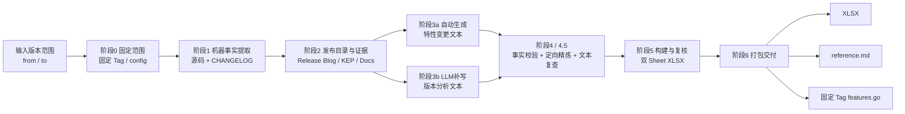
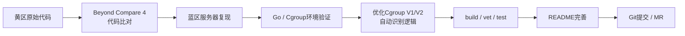
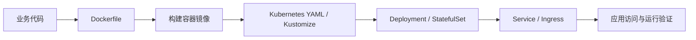

# 实习工作总结大纲

> 建议整体叙事主线：**核心项目实践 → 技术学习与能力建设 → 技术分享与竞赛 → 产出与荣誉 → 实习总结**。  
> 重点突出三个关键词：**自动化、工程实践、技术沉淀**。

---

## 一、实习工作概览

### 1.1 总体内容

本节作为全文开篇，用 1 段话概括实习期间的主要工作方向：

- 围绕 Kubernetes 版本升级场景，完成 **K8s 版本分析与特性变更自动化 SKILL** 的设计与实现；
- 参与 **Go 性能分析（pprof）项目** 的跨区复现、Cgroup 兼容逻辑优化与代码提交；
- 完成 **“访客计数器”微服务** 从代码、镜像到 Kubernetes 部署的完整实践，并参与 BMC 硬件部署实操；
- 系统学习 Go、Kubernetes 控制平面及云原生基础，并进一步研究 AgentENV、CubeSandbox 等 **AI Agent 安全沙箱机制**；
- 通过会议报告、W3 博客、竞赛等方式进行技术输出与能力验证。

### 1.2 建议呈现方式

可在开篇增加一行关键词：

`Kubernetes / Go / pprof / Cgroup / Docker / K8s Deployment / AI Agent Sandbox / Git & MR`

---

# 二、核心工作与项目实践

## 2.1 K8s 版本分析与特性变更自动化实现

### 2.1.1 项目背景

建议说明：

- Kubernetes 版本升级信息分散在 Release Blog、CHANGELOG、FeatureGate 源码、KEP 和官方文档中；
- 人工分析存在资料检索耗时、FeatureGate 状态易遗漏、分析标准不统一、结果复用困难等问题；
- 因此将版本分析过程沉淀为可迁移、可复用的自动化 SKILL。

### 2.1.2 主要工作

建议按“输入—处理—输出”描述：

- 输入起始版本、目标版本及输出路径；
- 固定 Kubernetes 官方 Tag，获取官方源码、CHANGELOG、Release Blog 等资料；
- 从固定版本源码中提取 FeatureGate 阶段、默认值及版本变化等机器事实；
- 从正式发行博客建立 Stable / Beta / Alpha 特性目录，并补充必要的 KEP、官方文档证据；
- 自动生成或补写版本分析、特性变更内容，并进行事实校验、文本复查和定向精炼；
- 最终生成 **“版本分析 / 特性变更”双 Sheet XLSX**，同时输出参考网址及固定版本源码证据包；
- 8 月 11 日完成《K8s版本分析与特性变更的自动化实现》会议报告。

### 2.1.3 项目产出

- 可复用的 Kubernetes 版本分析 SKILL；
- `版本分析 + 特性变更` 双 Sheet XLSX；
- `reference.md` 官方参考资料清单；
- 固定版本 `features.go` 源码证据；
- 可针对不同 Kubernetes 版本范围重复执行。

### 图 1：K8s 版本分析 SKILL 逻辑图

### 2.1.4 本节希望体现的能力

- 将重复性分析工作抽象为标准化流水线；
- 对 Kubernetes FeatureGate、版本升级和官方资料体系的理解；
- 自动化脚本、LLM 辅助分析与事实校验结合；
- 从“完成一次任务”提升到“沉淀可复用工具”。

---

## 2.2 Go 性能分析（pprof）项目跨区复现与优化

### 2.2.1 工作背景

项目面向 Go 服务运行时性能数据自动导出，通过内存压力或信号触发 runtime/pprof 数据落盘，用于后续分析内存泄漏、goroutine 泄漏及 CPU 热点。

### 2.2.2 主要工作

- **跨区代码同步与校验**：在蓝区服务器完成项目复现，并使用 Beyond Compare 4 对蓝区 / 黄区代码进行一致性比对；
- **运行环境验证**：完成 Go 环境、Linux/ARM64、Cgroup 等运行条件检查；
- **逻辑优化**：改进 `main.go` 中 Cgroup V1 / V2 自动识别与适配逻辑，减少对固定 Cgroup 版本的依赖；
- **质量验证**：项目材料中 `go build ./...`、`go vet ./...` 均通过，29 个测试函数全部 PASS；
- **文档完善**：补充 README 使用说明、Cgroup 兼容性及运行方法；
- **代码协作**：熟练使用 Git 完成代码提交，并完成从 CodeHub 到 GitCode 的 MR 提案流程。

### 2.2.3 建议配图：跨区复现与优化流程

### 2.2.4 本节希望体现的能力

- Go 项目阅读、调试与性能工具理解；
- Linux Cgroup V1 / V2 环境差异处理；
- 跨环境复现与问题定位；
- Git、Code Review、MR 等工程协作流程。

---

## 2.3 微服务项目与 BMC 硬件部署实操

### 2.3.1 “访客计数器”微服务部署闭环

建议突出“从代码到集群运行”的完整链路：

- 借助 AI 辅助开发“访客计数器”微服务；
- 编写 Dockerfile 完成应用镜像打包；
- 编写 Kubernetes YAML / Kustomize 配置；
- 使用 Deployment、StatefulSet、Service、Ingress、HPA、ConfigMap、Secret、PVC、RBAC、NetworkPolicy 等资源完成部署实践；
- 通过 Redis StatefulSet 实现访问计数持久化，并结合探针、资源限制、sidecar、initContainer 等机制学习 Pod 生命周期与运维能力；
- 跑通 **代码构建 → 镜像打包 → YAML 编写 → Kubernetes 拉起 → 服务验证** 全流程；
- 项目开源至 GitHub。

### 图 3：微服务部署链路

### 2.3.2 BMC 硬件部署实操

本节在正式总结中建议简要说明：

- 参与微服务器及 BMC 相关硬件部署实践；
- 将软件侧容器/Kubernetes 部署与实际服务器环境联系起来，形成从开发、镜像、集群到硬件环境的整体认识；
- 当前材料未提供具体服务器型号、BMC 配置步骤和验证结果，正式正文中可根据实际操作记录补充，不建议虚构硬件参数。

### 2.3.3 本节希望体现的能力

- Docker 与 Kubernetes 实际部署能力；
- 从应用代码到运行环境的端到端工程意识；
- 对容器、集群、服务器硬件之间关系的理解。

---

# 三、技术学习与能力建设

## 3.1 云原生基础学习

### 3.1.1 Go 语言

建议概括为：

- 结合 pprof 项目进行 Go 项目结构、模块、测试及运行时分析实践；
- 熟悉常用 Go 工程命令及项目调试方式；
- 理解 pprof、goroutine、内存分析以及 Cgroup 环境适配等工程问题。

### 3.1.2 Kubernetes 与容器基础

结合“访客计数器”项目，建议按以下层次总结：

- Docker：镜像、容器、Dockerfile、镜像构建；
- K8s 工作负载：Pod、Deployment、StatefulSet、DaemonSet、Job、CronJob；
- 网络：Service、Ingress、NetworkPolicy；
- 配置与存储：ConfigMap、Secret、PVC；
- 弹性与安全：HPA、RBAC、securityContext；
- Pod 生命周期：initContainer、sidecar、liveness/readiness probe、优雅关闭；
- Kubernetes 控制平面：进一步理解 API Server、Scheduler、Controller Manager、etcd 等核心组件及声明式调和机制。

### 3.1.3 学习结果

从“了解 Kubernetes 概念”逐步过渡到“能读 YAML、能部署、能排查、能分析版本变化”。

---

## 3.2 深入学习 AI Agent 安全沙箱机制

### 3.2.1 AgentENV 学习重点

建议围绕以下内容展开：

- 面向 AI Agent 的自托管、分布式 Sandbox Runtime；
- 通过 Firecracker microVM 提供独立 Guest Kernel 与硬件级隔离；
- 支持 OCI 镜像按需加载，并结合 OverlayBD、ublk 等机制优化镜像与 I/O；
- 支持 Snapshot、Pause / Resume、Fork 等 Agent 工作流需要的生命周期能力；
- 提供 E2B-compatible API，方便 Agent / E2B SDK 接入；
- 关注大规模 Agent 环境、Agentic RL、评测与并行执行等场景。

### 3.2.2 CubeSandbox 学习重点

建议围绕以下内容展开：

- 面向 AI Agent 场景的 KVM MicroVM 基础设施；
- 控制面由 CubeAPI、CubeMaster、Redis 等组件协同，数据面负责 VM、存储、网络和访问路由；
- CubeHypervisor 基于 RustVMM 管理 MicroVM；
- CubeCoW 通过文件系统 reflink / FICLONE 实现快速快照与克隆；
- CubeVS 使用 eBPF 处理网络转发与策略，CubeEgress 提供 L7 出网控制、审计及凭据注入；
- 同样提供 E2B 兼容接口，支持代码执行、暂停恢复、网络策略等沙箱能力。

### 表 1：AgentENV vs CubeSandbox 对比表

| 对比维度 | AgentENV | CubeSandbox |
| --- | --- | --- |
| 核心定位 | 大规模运行 Agent 环境的自托管/分布式 Sandbox Runtime | 面向 AI Agent 的 MicroVM 沙箱基础设施 |
| 虚拟化隔离 | Firecracker microVM | KVM MicroVM，CubeHypervisor 基于 RustVMM |
| API 兼容 | E2B-compatible HTTP API | E2B-compatible REST / SDK |
| 镜像 / RootFS | OCI 镜像按需加载，重点使用 OverlayBD | 模板 / RootFS，结合 CubeCoW 管理卷和快照 |
| 存储机制 | OverlayBD + ublk，本地有界缓存，支持增量快照 | xfs-reflink / FICLONE CoW，支持 O(1) 快照和克隆 |
| 生命周期 | Start、Pause、Resume、Snapshot、Fork | Create、Pause、Resume、Snapshot / Clone 等 |
| 网络关注点 | 沙箱网络与分布式运行，重点关注大规模环境调度与性能 | CubeVS(eBPF) + CubeEgress(L7)，突出出网策略、审计和安全控制 |
| 典型学习场景 | Agentic RL、批量 Sandbox、Benchmark / Eval、Agent 执行环境 | Agent 代码执行、安全沙箱、长时 Agent / 服务、受控网络访问 |
| 学习重点 | “大规模环境 + OCI 按需加载 + Snapshot/Fork + I/O/内存效率” | “MicroVM + CoW 快照 + eBPF 网络 + 零信任出网” |

### 3.2.3 本节希望体现的能力

- 从 Kubernetes 容器隔离进一步延伸到 MicroVM 隔离；
- 理解 AI Agent 为什么需要独立执行环境、快照、恢复、Fork 和网络安全；
- 能从计算、存储、网络、控制面四个维度阅读并比较复杂开源系统架构。

---

# 四、技术分享、知识沉淀与竞赛

## 4.1 技术分享

### 4.1.1 会议报告

- **时间：** 2026 年 8 月 11 日；
- **主题：**《K8s版本分析与特性变更的自动化实现》；
- 建议正文重点说明从人工版本分析痛点、自动化流程设计到最终 SKILL 产出的完整思路。

## 4.2 技术内容沉淀

- 发布 Kubernetes 版本分析 SKILL；
- 输出 **2 篇 W3 博客**；
- 在项目实践中持续补充 README、学习笔记、验证报告等技术文档。

> 两篇 W3 博客的具体标题当前材料未提供，正式总结时补充标题即可。

## 4.3 竞赛经历

### 4.3.1 获奖

- **2026 ICT 软件大赛难题赛道一等奖**。

### 4.3.2 其他竞赛实践

- 参加 Hackathon 软件难题挑战赛预赛；
- 参加高精度 4Bit 数值转换算法大赛；
- 虽未获奖，但积累了问题拆解、方案实现、算法优化及竞赛协作经验。

---

# 五、产出与荣誉清单

建议采用图标清单，放在总结后半部分，突出可量化成果：

- 🛠️ **1 个发布的 SKILL** —— Kubernetes 版本分析与特性变更自动化
- 📝 **2 篇 W3 博客** —— 技术学习与项目经验沉淀
- 🎤 **1 次会议报告** —— 2026.08.11《K8s版本分析与特性变更的自动化实现》
- 🏆 **1 个一等奖** —— 2026 ICT 软件大赛难题赛道一等奖

可在下一行补充非获奖但有价值的实践：

- 💻 Hackathon 软件难题挑战赛预赛
- 🔢 高精度 4Bit 数值转换算法大赛
- 🚀 “访客计数器”Kubernetes 学习项目开源至 GitHub
- 🔧 Go pprof 项目跨区复现、优化与 MR 实践

---

# 六、实习收获与总结

## 6.1 技术能力

建议归纳为三条：

1. **云原生工程能力**：从 Docker、Kubernetes 基础实践进一步深入到版本升级分析、Cgroup、Go 性能工具等问题；
2. **自动化与工具化能力**：将人工 Kubernetes 版本分析流程沉淀为可重复运行的 SKILL；
3. **系统架构理解能力**：从容器编排进一步学习 Firecracker / KVM MicroVM、Agent Sandbox、快照、存储和网络隔离机制。

## 6.2 工程协作能力

- 熟悉代码同步、环境复现、测试验证、README 维护；
- 熟悉 Git 提交、分支协作及 MR 提案流程；
- 能够通过会议报告、博客及文档将技术实践进行结构化输出。

## 6.3 总结句建议

全文最后可围绕以下方向收束：

> 本次实习完成了从“学习云原生基础”到“参与真实工程项目”，再到“将经验沉淀为自动化工具和技术输出”的能力进阶；不仅提升了 Kubernetes、Go 与系统工程实践能力，也进一步建立了对 AI Agent Sandbox 等新型基础设施的系统认识。

---

# 七、建议最终文档的图表配置

| 位置 | 图 / 表 | 作用 |
| --- | --- | --- |
| 2.1 | K8s 版本分析 SKILL 逻辑图 | 展示最核心的自动化工作与技术含量 |
| 2.2 | pprof 跨区复现与优化流程图 | 展示工程复现、优化、验证、提交闭环 |
| 2.3 | 微服务部署链路图 | 展示代码到 K8s 运行的完整部署能力 |
| 3.2 | AgentENV vs CubeSandbox 对比表 | 展示对 AI Agent 安全沙箱架构的深入学习 |
| 5 | 产出与荣誉图标清单 | 快速突出 SKILL、博客、报告与一等奖 |

