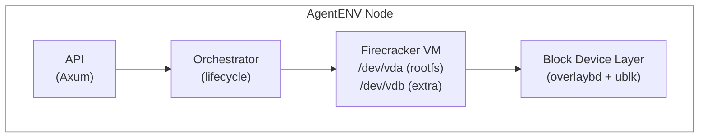
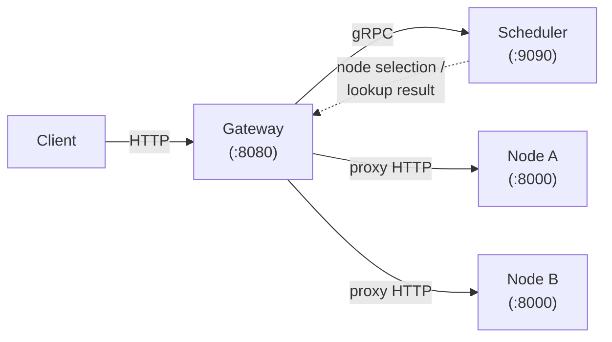

# How AgentENV Works

AgentENV runs AI agents inside isolated Firecracker microVMs. Each sandbox is a lightweight Linux VM with its own kernel, filesystem, and network namespace.

## System Overview

## Request Flow

1. A client sends an HTTP request to the AgentENV API (for example, `POST /sandboxes`).
2. The **API layer** validates the request, checks authentication, and forwards it to the **orchestrator**.
3. The **orchestrator** manages the sandbox lifecycle: it creates a Firecracker VM, sets up networking, and attaches block devices.
4. The VM boots with a **layered block device** (overlaybd) that stacks read-only base image layers with a writable upper layer. Multiple sandboxes share the same base layers.
5. Inside the VM, an **envd** daemon handles command execution, file operations, and health reporting.
6. Clients interact with running sandboxes via the **reverse proxy** (`/proxy`, routing headers, or configured sandbox proxy domains), which forwards HTTP and WebSocket traffic to services inside the VM.

## Key Components

| Component | What It Does |
|-----------|-------------|
| **API Server** | HTTP server exposing E2B-compatible endpoints for sandbox and template management |
| **Orchestrator** | State machine managing sandbox lifecycle transitions (create, pause, resume, delete) |
| **Firecracker VM** | Lightweight microVM providing kernel-level isolation per sandbox |
| **Block Device Layer** | overlaybd (layered images) + ublk (userspace block devices) for efficient storage |
| **envd** | In-guest daemon for executing commands, streaming output, and managing processes |
| **Reverse Proxy** | Routes HTTP/WebSocket traffic from clients to services running inside sandboxes |
| **Snapshot Manager** | Manages committed snapshots for efficient sandbox creation and reuse |
| **Template Builder** | User-facing build layer that declaratively produces committed snapshots with pre-installed software |

## Multi-Node Architecture

For multi-node deployments, a **gateway** and **scheduler** sit in front of multiple AgentENV nodes:

The gateway routes requests by sandbox ID. For new sandboxes, the scheduler picks a node. For existing sandboxes, the scheduler looks up the node that owns it. See [Deployment](../deployment/docker-compose.md) for setup instructions.
