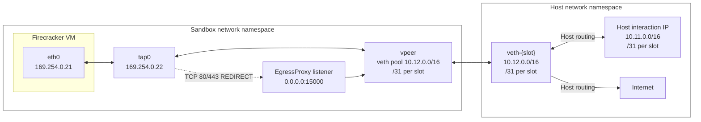
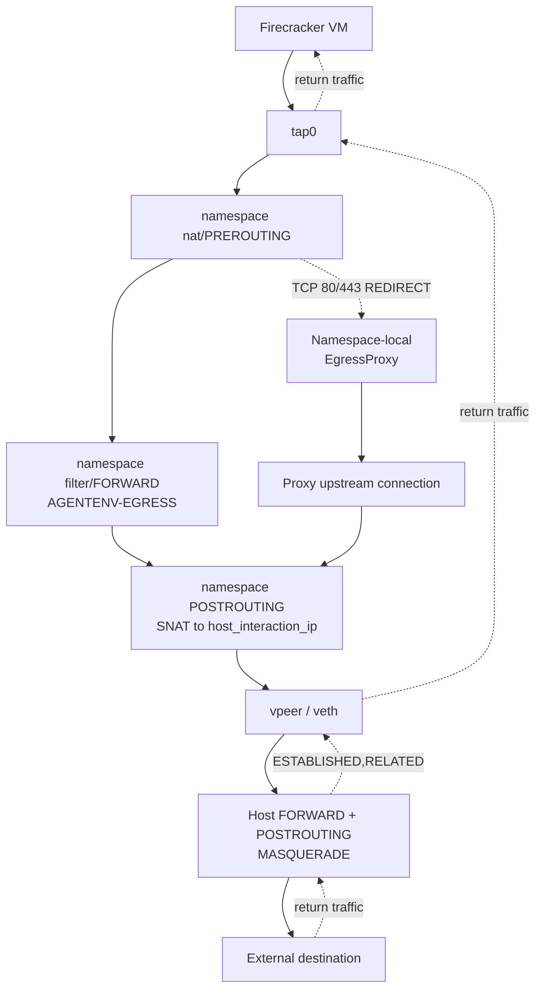

# Sandbox Network Architecture

This document describes the network data plane for one AgentENV node. It covers the Linux network namespaces used by Firecracker sandboxes, host and namespace iptables, runtime egress policy updates, and the namespace-local egress proxy.

The user-facing policy contract is documented in [Sandbox Network Access](../concepts/sandboxes.md#network-access). This page explains how that contract is implemented.

## Topology

Each running sandbox has a dedicated network namespace. The Firecracker VM is connected to the namespace through a TAP device. The namespace is connected to the host through a veth pair; the namespace side is named `vpeer` and the host side is named `veth-{slot}`.



The process contains one global `NetworkManager` and one global `EgressProxy` registry. The registry is shared for lifecycle and policy bookkeeping, but each namespace that uses proxy-backed policy has its own listener socket and listener thread. The fixed port `15000` is therefore reusable across namespaces without a host-port collision.

## Ownership

| Owner | Source | Responsibility |
| --- | --- | --- |
| `NetworkManager` | `src/sandbox/network/manager.rs` | Process-wide slot bitmap, warm pool, global host iptables, proxy registry, shutdown |
| `Slot` | `src/sandbox/network/slot.rs` | One namespace, veth/TAP setup, address plan, namespace iptables, policy application, cleanup |
| Address plan | `src/sandbox/network/address_plan.rs` | Slot-derived host interaction, veth, and VM-link addresses and internal deny ranges |
| Policy | `src/sandbox/network/policy.rs` | API-normalized base/allow/deny semantics, absolute deny checks, proxy interception ports |
| Egress proxy | `src/sandbox/network/egress_proxy.rs` | Namespace-local listener, original-destination inspection, Host/SNI parsing, relay, staged policy state |
| Host resolver | `src/sandbox/network/resolver.rs` | Process-wide long-lived host-netns DNS worker used for trusted domain resolution |
| Firecracker backend | `src/sandbox/firecracker/sandbox.rs` | Allocates/releases slots and applies the launch or updated policy at VM lifecycle boundaries |
| Orchestrator/API | `src/orchestrator/`, `src/api/impls/sandbox.rs` | Validates requests, persists policy, and replaces the running sandbox policy |

## Address Plan

`NetworkAddressPlan` derives addresses from `[network.internal]` and allocates them from the slot index:

- `host_interaction_ip`: one address per slot from `host_interaction_cidr`. Host routes use this address to reach the VM through the namespace.
- `veth_host_ip` and `veth_vm_ip`: the two endpoints of the slot's `/31` veth link. The host endpoint is assigned to `veth-{slot}` and the namespace endpoint is assigned to `vpeer`.
- `vm_ip` and `tap_ip`: fixed endpoints of the VM link on `vm_link_cidr`. The VM receives `vm_ip`; the namespace TAP interface receives `tap_ip`.

The namespace adds a default route through `veth_host_ip`. Firecracker receives an `ip=` boot argument containing the VM address, TAP link, netmask, and the guest DNS server selected from the host resolver configuration.

The complete internal pools are denied before user egress rules. This prevents a sandbox from reaching another slot's host-interaction address, veth link, or VM link even when a user policy otherwise allows the destination.

## Namespace Setup

`Slot::create_network()` performs namespace setup on a dedicated thread because network namespace membership is thread-local:

1. Create and bind-mount a persistent namespace file under the configured runtime `netns` directory.
2. Unshare `CLONE_NEWNET` and create the veth pair.
3. Move the host endpoint to the process's baseline host namespace.
4. Configure `lo`, `vpeer`, `tap0`, addresses, link state, and the namespace default route.
5. Enable namespace IPv4 forwarding and configure namespace NAT/filter rules.
6. Configure the host veth address and a host route for the slot's `host_interaction_ip`.

The baseline namespace rules are installed once during setup. Per-sandbox user rules and proxy redirects are replaced later by `set_egress_policy()`.

## Packet Paths



### Sandbox-originated internet traffic

1. The VM sends a packet through `eth0` to `tap0`.
2. The namespace NAT `PREROUTING` chain may redirect TCP ports 80 and 443 to the namespace-local proxy.
3. Packets that continue as routed traffic traverse `filter/FORWARD` from `tap0` to `vpeer`, entering `AGENTENV-EGRESS`.
4. The namespace `POSTROUTING` chain SNATs VM-originated traffic to the slot's `host_interaction_ip`. Proxy-originated upstream connections are SNATed from the namespace `vpeer` address to the same slot identity.
5. The host `FORWARD` and `POSTROUTING` rules accept the slot source range and MASQUERADE it for the external route.

### Return traffic

Return packets are classified as `ESTABLISHED,RELATED` and are accepted before the user egress chain in the namespace. The host also accepts established traffic returning to `veth-{slot}`. This preserves host/envd/proxy responses and existing outbound flows while policy rules are replaced.

### Host-to-VM traffic

Host-side proxy and envd traffic targets the slot's `host_interaction_ip`. Namespace `PREROUTING` on `vpeer` DNATs that address to the VM's fixed `vm_ip`. The corresponding return path is accepted by the established/related rules.

## Host Firewall

`NetworkManager` installs one process-wide set of host rules for the configured host interaction CIDR. The rules are inserted/appended symmetrically and removed during manager shutdown:

```text
INPUT      -i veth-+ -s <host_interaction_cidr> -m conntrack --ctstate ESTABLISHED,RELATED -j ACCEPT
INPUT      -i veth-+ -s <host_interaction_cidr> -j REJECT
FORWARD    -i veth-+ -s <host_interaction_cidr> -j ACCEPT
FORWARD    -o veth-+ -d <host_interaction_cidr> --state ESTABLISHED,RELATED -j ACCEPT
POSTROUTING -s <host_interaction_cidr> -j MASQUERADE
```

The `INPUT` pair prevents guest-originated new connections from reaching arbitrary host services while preserving established host-originated traffic. The `FORWARD` and `MASQUERADE` rules handle namespace-to-internet forwarding after namespace SNAT.

## Namespace Firewall

Each namespace has three managed chains:

- `AGENTENV-EGRESS` is the static chain reached from `FORWARD` for guest traffic.
- `AGENTENV-USER-EGRESS` contains the replaceable user policy.
- `AGENTENV-EGRESS-PROXY` is the replaceable NAT chain reached from `nat/PREROUTING` for proxy-backed traffic.

The static filter chain is ordered as follows:

1. Accept `ESTABLISHED,RELATED` traffic from `tap0` to `vpeer`.
2. Allow UDP/TCP DNS traffic to the configured guest DNS address on port 53.
3. Reject the complete internal address pools and configured `always_denied_cidrs`.
4. Jump to `AGENTENV-USER-EGRESS`.

The user chain is rendered in this order:

1. Explicit `allowOut` CIDR/IP rules (`ACCEPT`).
2. Explicit `denyOut` CIDR/IP rules (`REJECT`).
3. A `0.0.0.0/0` reject when the base policy is `Deny`.

This ordering gives user allow rules precedence over overlapping user denies, while static internal/platform denies remain non-overridable.

## Egress Proxy

The egress proxy is namespace-local and transparent. It does not terminate TLS or rewrite HTTP. A policy that requires proxy mediation redirects only TCP ports 80 and 443 to `0.0.0.0:15000` inside that namespace.

### Connection flow

1. `EgressProxy::ensure_listener()` enters the target namespace with `setns`, binds the listener, and starts a nonblocking accept loop.
2. The listener accepts a connection and copies the active policy for that connection.
3. The connection handler reads `SO_ORIGINAL_DST` to recover the destination altered by `REDIRECT`.
4. It buffers the initial request/handshake up to 64 KiB and extracts HTTP `Host` or TLS ClientHello SNI. TLS handshake bytes are accumulated across record boundaries.
5. A domain match is sent to the process-wide resolver worker, which remains in the host network namespace. Each candidate IPv4 address is checked by `SandboxNetworkPolicy::is_domain_allowed`, including absolute platform and internal-range denies, before it is selected.
6. A domain connection is dialed to the selected trusted address. An IP/CIDR connection uses the original destination after `is_ip_allowed`.
7. The buffered preface is written to the upstream and both directions are relayed with half-close handling.

An empty or unrecognized hostname cannot fall back to the base allow policy when a domain allowlist is present. This keeps domain policies fail-closed. Domain allow rules require the API request to include an explicit `denyOut: ["0.0.0.0/0"]`.

### Policy replacement

The running policy update is a replacement operation:

1. Stage the new policy in the proxy's `pending` map.
2. Ensure the namespace listener exists when proxy mediation is required.
3. Apply the filter and NAT chain replacement as one `iptables-restore` batch.
4. When an active proxy policy already exists, activate the pending policy only after the namespace batch succeeds.
5. When proxy mediation is being enabled for a namespace with no active proxy policy, activate the prepared policy before installing the redirect. This preserves the namespace's previous default-allow behavior until the atomic iptables batch has completed; no connection can reach the listener through `REDIRECT` before that batch succeeds.
6. If an update fails while an active proxy policy exists, discard the pending policy and retain the previous active policy.

Each accepted connection holds a copy of the active policy selected at accept time. Therefore updates primarily affect new connections; existing relays are not proactively terminated. Removing a policy or a slot closes tracked handler sockets and joins their threads before namespace resources are removed.

### Namespace ownership

The process-global registry is keyed by `host_interaction_ip`, but listeners are not shared between namespaces. Every namespace has its own listener thread and socket. When a policy no longer requires proxy mediation, the listener and active/pending policy are removed. Full slot cleanup stops the listener before deleting the veth and unmounting the namespace.

## Lifecycle and Warm Pool

`NetworkManager::allocate_any()` first acquires a warm `Slot`. If none is available it allocates a new slot index and creates the namespace/veth/TAP resources. The Firecracker backend then applies the launch policy before boot or resume continues.

On stop, a slot may return to the warm pool. The namespace and baseline networking remain available for reuse; `user_egress_rules_present` tracks whether the next tenant needs a user-chain replacement. The next policy application clears or replaces stale user rules and removes stale proxy policy as appropriate. Slots drained from the pool are fully cleaned up.

On shutdown, the manager stops pool maintenance, drains warm slots, stops all proxy listeners, removes global host rules, and removes namespace/veth state. An `atexit` hook and `Drop` path provide best-effort cleanup for abnormal exits.
