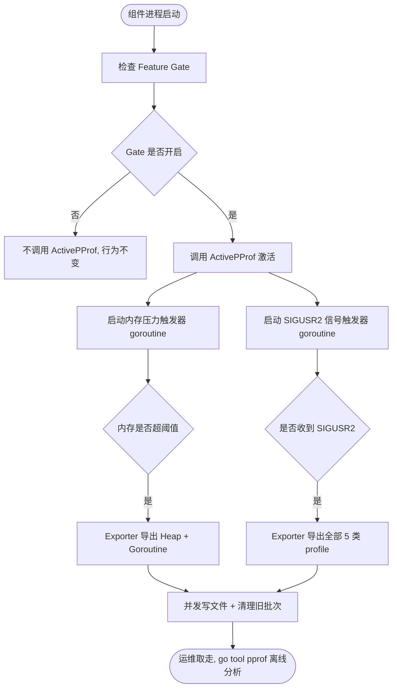
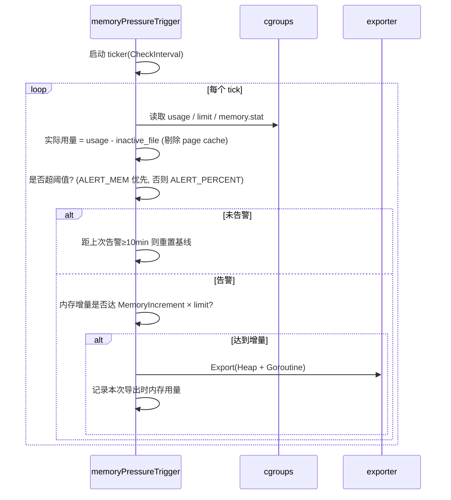
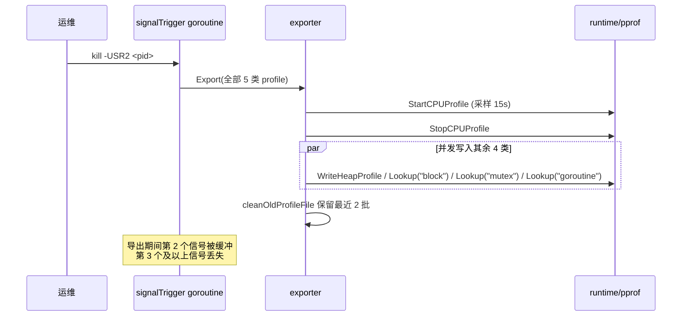

<!--
**注意：**当你的 oFEP 完成时，应删除所有这些注释块。

要开始使用此模板：
- [ ] **选择一个托管 SIG。**
  确保该问题领域是 SIG 感兴趣的。如果没有 SIG 的赞助，oFEP 不应提交。
-[]**在 openfuyao/ofep 中创建问题**
  提交增强功能跟踪问题时，请务必填写该模板中的所有字段。其中一个字段要求提供指向 oFEP 的链接。你可以留空该字段，直到提交此 oFEP 后再返回到增强功能并添加链接。
- [ ] **复制此模板目录。**
  将此模板复制到所属 SIG 的目录中，并将其命名为"ofep-NNNN-short-descriptive-title"，其中"NNNN"是分配给上述增强功能的问题编号（没有前导零填充）。
- [ ] **尽可能多地填写以上oFEP元数据。**
  至少，你应该填写"标题"、"作者"、"SIG所有者"、"状态"和与日期相关的字段。
- [ ] **请尽可能详细地填写此文件。**
  至少，你应该填写"摘要"和"动机"部分。如果你已经和相关的 SIG 进行过前期沟通和想法验证，那么这两部分应该会很容易完成。
- [ ] **为此 oFEP 创建 PR。**
  将其指派给正在支持该流程的 SIG（特别兴趣小组）成员。
- [ ] **尽早合并并迭代。**
  避免纠结于具体细节，而应致力于明确 oFEP 的目标并快速合并。最好的方法是从概要部分开始，然后在后续的 PR 中逐步完善细节。

oFEP 合并并不意味着它已完成或获得批准。任何标记为"临时"的 oFEP 都是工作文档，可能会发生变更。你可以按以下方式标记正在积极讨论的部分：

编辑 oFEPS 时，请尽量使用范围明确、主题单一的 PR，以保持讨论的集中性。如果你不同意文档中已有的内容，请提交新的 PR 并提出修改建议。

一个 oFEP 对应其整个生命周期内的一项"功能"或"增强"。例如，从 Beta 版升级到 GA 版无需新的 oFEP。如果出现属于 oFEP 的新细节，请编辑 oFEP。一旦某个功能被"实现"，重大变更应该获得新的 oFEP。

最新（以及该文件的可能来源）的规范位置是[0000-ofep-template.md]（/0000-ofep-template.md）。

**注意：**任何将 oFEP 推进为"implementable"状态的 PR，或在标记为"implementable"后的重大更改，都必须得到每个 oFEP 批准人的批准。如果这些批准人均不合适（例如离开社区、角色变更等），则该列表的更改应由其余批准人和/或所属 SIG 批准。
-->
# oFEP-0000：pprof-export支持运行时性能诊断自动导出

<!--
这是你的 oFEP 的标题。请保持简短、简洁且描述性强。一个好的标题可以帮助传达什么是 oFEP，以及有助于审查与追踪。
-->

<!--
目录（TOC）有助于快速跳转到 oFEP 的各个部分，同时突出显示超出标准模板所提供的其他信息。

确保目录已用<code>&lt;!-- toc --&gt;&lt;!-- /toc --&gt;</code>标签，然后用`hack/update-toc.sh`生成。
-->

<!-- toc -->
- [发布签核清单](#release-signoff-checklist)
- [摘要](#summary)
- [动机](#motivation)
  - [目标](#goals)
  - [非目标](#non-goals)
- [提案](#proposal)
  - [用户故事（可选）](#user-stories-optional)
    - [故事 1](#story-1)
    - [故事 2](#story-2)
  - [注释/约束/警告（可选）](#notesconstraintscaveats-optional)
  - [风险与缓解措施](#risks-and-mitigations)
- [设计细节](#design-details)
  - [测试计划](#test-plan)
      - [先决条件测试更新](#prerequisite-testing-updates)
      - [单元测试](#unit-tests)
      - [集成测试](#integration-tests)
      - [e2e 测试](#e2e-tests)
  - [毕业标准](#graduation-criteria)
  - [升级/降级策略](#upgrade--downgrade-strategy)
  - [版本倾斜策略](#version-skew-strategy)
- [生产准备情况评审问卷](#production-readiness-review-questionnaire)
  - [功能启用和回滚](#feature-enablement-and-rollback)
  - [推出、升级和回滚规划](#rollout-upgrade-and-rollback-planning)
  - [监控要求](#monitoring-requirements)
  - [依赖项](#dependencies)
  - [可扩展性](#scalability)
  - [故障排除](#troubleshooting)
- [实施历史](#implementation-history)
- [缺点](#drawbacks)
- [替代方案](#alternatives)
- [所需基础设施（可选）](#infrastructure-needed-optional)
<!-- /toc -->

## 发布签核清单
<!--
**需要采取的行动：**为了将代码合并到一个版本中，在[openfuyao/ofep]引用此oFEP并在目标版本的[增强冻结]之前瞄准发布里程碑**中必须存在问题。

对于对核心代码或流程/程序进行更改的增强功能，例如：[openfuyao/openfuyao]，我们需要完成以下发布签署清单。

完成后勾选这些，以便发布团队跟踪。为了发布增强，必须更新这些检查表项。
-->

标记有（R）的项目*在达到里程碑/发布*之前是必需的。
- [ ]（R）发布里程碑中的增强问题，链接到 [openfuyao/ofep] 中的 oFEP 目录
- [ ] (R) oFEP 审批者已批准 oFEP 状态为"可实施"
- [ ] (R) 设计细节已适当记录
- [ ]（R）测试计划已到位，并考虑了 SIG 架构和 SIG 测试的输入（包括测试重构）
  - [ ] 针对所有 Beta API 操作（端点）进行 e2e 测试
  - [ ] (R) 确保 GA e2e 测试满足一致性测试的要求
  - [ ] (R) GA e2e 测试至少需要两周时间才能证明测试结果无 flake（不稳定或偶发失败）
- [ ] (R) 毕业标准已设定
  - [ ] (R) 所有 GA 端点必须通过[一致性测试]
- [ ] (R) 生产准备情况审查完成
- [ ] (R) 生产准备情况审查已获批准
- [ ] "实施历史"部分已更新里程碑
- [ ] 面向用户的文档已在 [openfuyao/docs] 创建，以便发布到 [openfuyao.cn]
- [ ] 支持文档 - 例如，额外的设计文档、邮件列表讨论/SIG 会议链接、相关 PR/问题、发行说明

<!--
**注意：**此清单是迭代的，每次考虑将此增强功能作为里程碑时都应进行审查和更新。
-->

- [openfuyao.cn](https://openfuyao.cn/)
- [openfuyao/ofep](https://gitcode.com/openfuyao/ofep)
- [openfuyao/docs](https://gitcode.com/openfuyao/docs)

## 概括
<!--
这部分对于生成高质量、以用户为中心的文档（如发行说明或开发路线图）非常重要。应该在实现开始之前收集这些信息，以避免要求实现者在编写发行说明和实现功能本身之间分散注意力。oFEP 编辑器和SIG文档应该有助于确保"摘要"部分的语气和内容对广泛的受众有用。

好的摘要可能至少有一段长度。

在本节和下一节中，请遵循[文档样式指南]的指导方针。特别是，将代码行包装到合理的长度，使审阅者更容易引用特定的部分，并尽量减少更新的差异。
-->
openfuyao 组件为长驻 Go 进程，生产环境中可能出现内存泄漏、goroutine 泄漏等问题，当前缺少在故障发生时自动捕获诊断快照的机制。本提案开发了 `pprof-export` 库，进程启动时调用一次即可激活，提供内存压力自动触发与 SIGUSR2 信号主动触发两种方式将 pprof 快照落盘并自动清理，通过 Feature Gate 控制默认关闭、按组件灰度开启。


## 动机
<!--
本节用于明确列出该oFEP的动机、目标和非目标。描述变更的重要性以及对用户的好处。
-->

目前 openfuyao 组件的性能诊断手段存在以下痛点：

- **故障现场丢失**：泄漏往往表现为进程 OOM 被杀或异常重启，运维介入时堆栈已丢失；即便进程存活，现有 `net/http/pprof` 端点从发现异常到手动抓取也存在分钟级滞后，且 CPU profile 需持续采样 15s，故障窗口稍纵即逝；
- **诊断端点暴露风险**：`net/http/pprof` 端点常驻监听，可能泄露进程内存中的敏感数据，生产环境通常需额外配置关闭或鉴权。

### 目标
<!--
列出oFEP的具体目标。它想要达到什么目标？我们怎么知道这已经成功了？
-->
- 实现内存压力自动触发，基于 cgroup 真实内存用量超阈值时自动导出 Heap + Goroutine 快照；
- 实现 SIGUSR2 信号主动触发，运维可随时触发完整导出（CPU 采样 15s）。

### 非目标
<!--
什么超出了这个oFEP的范围？列出非目标有助于集中讨论并取得进展。
 -->


## 提案
<!--
**这是我们真正进入提案具体内容的部分。**  
这一部分应包含足够的细节，使评审人员能清晰理解你到底在提出什么建议，  
但不应涉及 API 设计或具体实现细节。  

请阐明：
- **预期目标是什么？**  
- **我们如何衡量成功？**

请将更详细的设计和实现细节放在下方的 "设计细节" 部分中。
-->

开发 `pprof-export` 作为 openfuyao 组件运行时性能诊断的标配库，各组件在启动入口调用一次即可激活，库内部以独立 goroutine 拉起两类触发器并行运行、互不阻塞业务主流程。

### 用户故事（可选）
<!--
详细说明如果该 oFEP 被实施，用户将能够做哪些事情。请尽可能提供细节，以便人们理解系统将"如何"运作。此部分的目标是：让用户对提案有真实的感受，而不是陷入技术细节的泥淖中。
-->

#### 故事 1

kube-controller-manager 长期运行后内存缓慢上涨，疑似 goroutine 泄漏。运维无需事先部署抓取脚本，组件启动时已激活 pprof-export。当内存达到 limit 的 80%（默认阈值）时，库自动落盘 Heap 与 Goroutine 快照。运维登录节点取走文件，用 `go tool pprof` 离线分析定位泄漏栈。整个过程无需人工干预、无需进程存活。

#### 故事 2

运维发现 kube-scheduler CPU 出现尖峰但持续不到 1 分钟便回落。执行 `kill -USR2`，pprof-export 立即启动 15s CPU 采样并同步导出完整快照。运维获得 profile 文件，离线分析定位热点函数。事后下一次导出时上一批旧文件被自动清理。


### 注释/限制/注意事项（可选）
<!--
该提案有哪些注意事项或潜在限制？
有没有上文未能充分表达的重要细节？
请在此处根据需要尽可能详细地展开说明。
这部分也非常适合用于讲解一些核心概念及它们之间的关联关系。
-->


- **CPU profile 采样间隔**：SIGUSR2 触发的 CPU 采样持续 15s，建议运维侧最小间隔约束（如 ≥1min）避免频繁采样。

### 风险与缓解措施
<!--
这个提案存在哪些风险？我们将如何加以缓解？请从广泛的角度思考，例如包括安全性问题，以及它可能对更大范围的 openfuyao 生态系统产生的影响。 安全性将由谁进行评审，以及如何评审？用户体验（UX）将由谁进行评审，以及如何评审？建议考虑邀请 SIG 外部或子项目之外的相关人员参与评估。
-->

## 设计细节
<!--
本节应包含足够的信息，以便读者能够清楚理解你所提出的变更具体是什么。这可能包括 API 规格说明（虽然并非必须）或代码片段。如果对该提案将如何实施存在任何疑问，应在此处进行详细讨论。
-->

### 整体架构

`pprof-export` 采用"门面编排 + 触发器 + 导出器"三层结构。组件进程启动时检查 Feature Gate，开启则调用 `ActivePProf()` 激活库，库内部以独立 goroutine 拉起两类触发器并行运行，触发条件命中时由 exporter 并发落盘并清理旧批次：



仓库目录结构：

```
pprof-export/
├── pprof/
│   ├── facade.go            # ActivePProf()：读取配置 → 组装 exporter + triggers → 启动
│   ├── exporter/
│   │   ├── interface.go     # Exporter 接口：Init() / Export(scope)
│   │   └── exporter.go      # 实现：并发写文件 + 按批清理
│   ├── names/
│   │   └── names.go         # Profile 名称枚举（CPU/Heap/Block/Mutex/Goroutine）与 Scope
│   └── trigger/
│       ├── interface.go     # Trigger 接口：Start(ctx)
│       ├── memory_pressure.go   # 内存压力触发器
│       └── os_signal.go     # SIGUSR2 信号触发器
├── util/
│   ├── cgroups/             # cgroup v1/v2 路径自适应（Linux 实现 + 非 Linux 桩）
│   └── env/                 # 环境变量读取（含默认值，非法值 panic）
├── log/                     # 日志（DEBUG/INFO/WARNING/ERROR/FATAL）
├── main.go                  # 演示程序（冒烟测试，非库本体）
├── main_test.go             # 空测试文件（仅 package main 声明）
└── go.mod                   # module pprof-export，依赖仅 golang.org/x/sys
```

### 集成入口与配置

业务进程启动时调用一次 `pprof.ActivePProf(ctx, prefix)`，`ctx` 取消即停止所有触发器。`prefix` 用于 profile 文件命名前缀（建议传组件名，如 `"kcm"`、`"kubelet"`）。

环境变量配置（全部可选，未设置用默认值）：

| 变量名 | 默认值 | 含义 |
|--------|--------|------|
| `HW_PROFILING_PATH` | `/opt/dump/coredump` | profile 输出目录 |
| `HW_PROFILING_CHECK_INTERVAL` | `1` (秒) | 内存压力检查周期 |
| `HW_PROFILING_ALERT_MEM` | `0` | 剩余内存低于该值（MiB）即触发，优先级高于百分比 |
| `HW_PROFILING_ALERT_PERCENT` | `0.8` | 使用率超该值即触发（`ALERT_MEM` 未设置时生效） |
| `HW_PROFILING_MEMERY_INCREMENT` | `0.08` | 持续告警时再次导出所需的最小内存增量（相对 limit） |

> `ALERT_MEM` 与 `ALERT_PERCENT` 同时为 0 时自动回退到 `0.8`。

Feature Gate `RuntimePProfExport`（默认 `false`）：组件在调用 `ActivePProf()` 前检查该 Gate，关闭时不调用，行为与未集成完全一致。Feature Gate 为集成层机制，需在 openfuyao 组件集成时实现，库本体不含该逻辑。

### 实现方案

`pprof-export` 内置两类触发器，启动后并行运行：

| 触发器 | 导出范围 | 触发条件 |
|--------|----------|----------|
| 内存压力 | Heap + Goroutine | cgroup 实际用量（usage − `inactive_file`）超阈值 |
| SIGUSR2 | CPU + Heap + Block + Mutex + Goroutine | 每收到一次信号，CPU 采样 15s |

启动流程见上方"整体架构"图。以下按功能分别说明：

#### 内存压力触发

周期性读取进程所属 cgroup 的内存用量，按阈值判定是否告警，命中且满足增量条件时调用 exporter 导出 Heap + Goroutine：



关键逻辑：

- 阈值判定：`ALERT_MEM` 设置时按剩余内存（`limit - usage < ALERT_MEM`）判定，优先级高于百分比；否则按使用率（`usage / limit > ALERT_PERCENT`）
- 导出节制：持续告警时要求内存相对上次导出再增 `MemoryIncrement × limit` 才再次导出；连续 10 分钟无告警重置基线
- 剔除 page cache：实际内存压力 = `usage - inactive_file`（来自 `memory.stat`），避免容器大量 page cache 被误判

```go
func (m *memoryPressureTrigger) isOnAlert(memInUsage, memLimit int64) bool {
    if m.AlertMem > 0 {
        return memLimit-memInUsage < m.AlertMem
    }
    return float64(memInUsage)/float64(memLimit) > m.AlertPercent
}

func (m *memoryPressureTrigger) shouldExport(memInUsage, memLimit, lastExportMemory int64) bool {
    if lastExportMemory == 0 {
        return true
    }
    increasePercent := float64(memInUsage-lastExportMemory) / float64(memLimit)
    return increasePercent >= m.MemoryIncrement
}
```

#### SIGUSR2 信号触发

监听 SIGUSR2，每收到一次信号即调用 exporter 导出全部 5 类 profile（CPU 采样 15s）：



```go
func (t *signalTrigger) Start(ctx context.Context) {
    ch := make(chan os.Signal, 1)
    sig := []os.Signal{syscall.Signal(SIGUSR2)}
    signal.Notify(ch, sig...)
    // ...
    for {
        select {
        case <-ctx.Done():
            signal.Stop(ch)
            return
        case <-ch:
            t.exporter.Export(pprofnames.AllProfiles())
        }
    }
}
```

#### 并发落盘与按批清理

`exporter.Export(scope)` 加锁后以同一时间戳生成一批文件，scope 内每个 profile 用独立 goroutine 并发写入（WaitGroup 同步），写完调用 `cleanOldProfileFile` 清理旧批次。当两个触发器同时触发时，两次导出排队执行而非并行，避免文件名时间戳冲突。

- 文件命名：`{prefix}-{YYYYMMDD-HHMMSS}-{type}.profile`，例如 `kcm-20260728-142656-heap.profile`
- 文件权限 `0600`；目录权限 `0750`
- CPU profile：`pprof.StartCPUProfile` 持续 15s 后 `StopCPUProfile`
- 保留策略：按时间戳排序保留最新 2 批，其余 `os.Remove` 删除

```go
func (e *exporter) Export(scope pprofnames.Scope) {
    e.Lock()
    defer e.Unlock()
    timestamp := time.Now().Format(timeFormat)
    var wg sync.WaitGroup
    for _, profile := range scope {
        wg.Add(1)
        go func(p pprofnames.Name) {
            defer wg.Done()
            e.exportProfile(p, timestamp)
        }(profile)
    }
    wg.Wait()
    e.cleanOldProfileFile()
}
```

#### cgroup v1/v2 自适应

通过 `statfs(/sys/fs/cgroup)` 判断是否为 `CGROUP2_SUPER_MAGIC` 自动识别版本（`sync.Once` 缓存），无需配置：

| 模式 | usage | limit | stat |
|------|-------|-------|------|
| **v2** | `memory.current` | `memory.max` | `memory.stat` |
| **v1** | `memory/memory.usage_in_bytes` | `memory/memory.limit_in_bytes` | `memory/memory.stat` |


### 测试计划
<!--
**注意：**在该提案尚未被纳入某个正式版本前，此部分不是必需的。
其目标是确保我们不会接收缺乏充分测试的增强功能。
所有代码都应具备充分的测试（最终也应满足测试覆盖率要求）。在撰写测试计划时，请遵循 openFuyao 测试指南。
-->

[ ] 我/我们理解，相关组件的所有者可能会要求更新已有的测试，以便在提交实现该增强功能所需的更改之前，使代码达到足够稳固的质量标准。

##### 先决条件测试更新
<!--
根据评审者的反馈，描述在实施此项增强功能之前需要补充哪些额外的测试，以确保该增强特性也具备稳固的基础。
-->

集成前需确认各组件启动入口具备可注入 `ActivePProf()` 调用的初始化阶段，并补齐 Feature Gate 读取与条件分支的单元测试桩。

##### 单元测试
<!--
原则上，所有新增的代码都应具有完整的单元测试覆盖率，因此列出确切的测试项并不会带来额外价值。
但如果无法实现完整的单元测试覆盖，请说明原因，并解释为何在这种情况下这是可以接受的。
-->

<!--
此外，对于 Alpha 阶段，请尽量列出为了实现该增强功能将涉及的核心包（core package），并提供这些包当前的单元测试覆盖率，格式如下：
- <软件包>: <日期> - <当前测试覆盖率>
这可以帮助我们在扩展生产代码、实施该增强功能之前，识别并推进某些测试覆盖率的改进工作。
-->


##### 集成测试
<!--
集成测试允许控制用于启动被测二进制文件的配置参数。
这与不允许配置参数的 e2e 测试不同。
这样做可以测试非默认选项以及多个不同的、可能冲突的命令行选项。

如果集成测试不是必要的或有用的，请解释原因。
-->

<!--
当准备将功能纳入某个正式版本时，需要填写此问题。
- 对于 Alpha 阶段，请描述将添加哪些测试，以确保该增强功能具备良好的质量保障。
- 对于 Beta 和 GA 阶段，需要记录测试已经编写、被定期执行，且结果稳定。

你可以通过以下方式提供相关证明：
- 指向 gitcode 源代码的永久链接
- 指向定期测试作业的链接，并按测试名称过滤
- 在 openfuyao 缺陷追踪工具中进行搜索。
-->

库本体已具备以下集成测试，覆盖核心链路：

- `TestExport`：验证单 profile/多 profile 导出及多次导出后的旧文件清理（含 3s 真实等待）
- `TestWriteCPUProfile`：验证 CPU profile 真实采样写入（1s 采样窗口）
- `TestExportOnAlert`：验证内存压力触发器的告警判定与增量阈值逻辑（7 子测试覆盖首次/重复/未达增量/绝对阈值/读取失败等场景）
- `TestSignalTriggerStartStop`：验证信号触发器的启动与 ctx 取消停止

##### e2e 测试
<!--
当该功能计划纳入某个正式版本时，应填写此问题。
- 对于 Alpha 阶段，请描述将添加哪些测试，以确保该增强功能具备良好的质量保障。
- 对于 Beta 和 GA 阶段，需要说明测试已经编写、被定期执行，且结果稳定。

可通过以下方式提供证明材料： 
- 指向 gitcode 源代码的永久链接
- 指向定期测试作业的链接，并按测试名称过滤
- 在 openfuyao 缺陷追踪工具中进行搜索。

作为进入 GA（正式可用）阶段的标准，我们期望过去一个月内不存在任何非基础设施相关的 flaky 测试（不稳定测试）。
如果你认为无需添加端到端测试（e2e），请解释其原因及合理性。
-->

| 用例名称 | 前置条件 | 用例步骤 | 预期结果 |
| -------- | -------- | -------- | -------- |
| 默认关闭 Feature Gate 行为不变 | `RuntimePProfExport=false` | 1. 启动组件<br />2. 检查 goroutine 数与磁盘 | 1. 无 pprof 触发器 goroutine<br />2. `${HW_PROFILING_PATH}` 无新增文件 |
| 内存压力自动触发 | `RuntimePProfExport=true`，cgroup limit=100MiB | 1. 持续分配内存<br />2. 等待达 80% 阈值 | 1. 自动生成 heap/goroutine profile<br />2. 文件可被 `go tool pprof -top` 解析<br />3. 增量阈值后生成第 2 批 |
| SIGUSR2 主动触发完整导出 | `RuntimePProfExport=true` | 1. `kill -USR2 <pid>`<br />2. 等待 15s | 1. 生成 cpu/heap/block/mutex/goroutine 5 个 profile<br />2. cpu.profile 含真实采样数据 |
| 自动清理仅保留 2 批 | `RuntimePProfExport=true` | 1. 连续触发 4 次导出 | 1. 目录仅保留最近 2 批<br />2. 旧批次被删除 |
| 关闭 Feature Gate 回滚 | 先开启再关闭 | 1. 关闭后重启<br />2. `kill -USR2` | 1. 无 profile 生成<br />2. 组件行为与未集成一致 |
| cgroup v1/v2 自适应 | 分别在 v1、v2 环境 | 1. 制造内存压力 | 1. 两种环境均能正确读取并触发<br />2. 日志打印 `detected cgroup v1` / `detected cgroup v2` |
| 绝对阈值优先级 | `HW_PROFILING_ALERT_MEM=256` | 1. 内存剩余降至 256MiB 以下 | 1. 按 ALERT_MEM 触发，百分比被忽略 |
| 非法环境变量 fail-fast | `HW_PROFILING_ALERT_PERCENT=abc` | 1. 启动组件 | 1. 进程 panic 退出 |


**性能测试**


### 毕业标准
<!--
> **注意：** *在功能尚未计划纳入某个正式版本时，本节无需填写。*
> 请在此处定义该功能的毕业（Graduation）里程碑。
> 毕业条件可以基于 API 成熟度、[Feature Gate] 的推进阶段，或其他方式来定义。此处应保持高层次，重点说明评估是否可以毕业时将参考哪些信号（信心指标）。
> 在制定毕业标准时，请参考以下内容：
> - [成熟度等级（`alpha`、`beta`、`stable`）]
> - [Feature Gate 生命周期][feature gate]
> - [弃用政策][deprecation-policy]
> 请明确说明“毕业”的定义。
> 通常我们倾向于无论功能通过何种方式访问，均采用相同的阶段划分（alpha、beta、GA）。

#### 🔹 Alpha 阶段
- 功能已通过 Feature Gate 实现（默认关闭）  
- 初步的端到端（e2e）测试已完成并启用  
#### 🔸 Beta 阶段
- 收集开发者反馈及用户调研结果  
- 完成核心功能 A、B、C  
- 额外的测试已加入 Testgrid，并在 oFEP 中有链接说明  
- 实现更严格的测试形式，例如降级测试和可扩展性测试  
- 所有功能均已实现  
- 所有安全相关机制均已完备  
- 所有监控要求均已实现  
- 所有测试要求均已满足  
- 所有预发布阶段的问题与缺陷均已修复  

> **注意：** Beta 阶段的评估标准必须包含所有功能、安全性、监控与测试的要求，并解决所有已知问题或差距。

#### 🟢 GA 阶段
- 有 N 个真实生产环境中的使用示例  
- 有 N 次实际安装部署记录  
- 已留出反馈窗口期，收集充分用户反馈  
- 所有在 Beta 阶段反馈的问题与缺陷都已解决  

> **注意：** GA 阶段的毕业标准不得再包含功能、安全性、监控或测试方面的要求，这些应在 Beta 阶段全部完成。
> **注意：** 通常，我们在 Beta 和 GA 之间至少间隔两个版本周期，以便留出时间获取用户反馈和发现潜在问题，避免在连续发布中遗漏反馈环节。
> **对于非可选（默认启用）功能在进入 GA 阶段时，毕业标准必须包含 [一致性测试（Conformance tests）]。**

#### 🧯 弃用（Deprecation）
- 宣布弃用现有功能标志（flag）并说明支持策略  
- 自引入替代功能以来，已过去两个版本（以解决版本偏差问题）  
- 处理来自 gitcode Issues 等反馈渠道中的用法变更或行为差异问题  
- 正式弃用原有标志 （flag）
-->
### 升级/降级策略
<!--
> 指导提案人在功能设计时兼顾向前兼容性、配置迁移、Feature Gate 管理等问题。
-->
<!--
如果适用，该组件在升级和降级时将如何处理？请确保在测试计划中包含这部分内容。

在制定该增强功能的升级/降级策略时，请考虑以下问题：
- 为了保持现有行为不变，集群在升级时是否需要进行调用方式、配置或 API 使用上的任何更改？
- 为了使用该增强功能，集群在升级时是否需要对调用方式、配置或 API 使用做出调整？
-->

### 版本倾斜策略
<!--
确保你的提案在 openfuyao 集群中升级时能够兼容不同版本组件之间的运行差异。
-->
<!--
如果适用，该组件在面对与其他组件的版本不一致（version skew）时将如何处理？有哪些兼容性保证？请确保在测试计划中包括这一部分。

在为此增强功能制定版本偏差应对策略时，请考虑以下问题：
- 该功能是否涉及控制面（Control Plane）与节点（Node）之间的协同行为？
- 当使用该功能时，版本落后三个版本（n-3）的 kubelet 或 kube-proxy 会如何表现？
- 当使用该功能时，版本落后一个版本（n-1）的 kube-controller-manager 或 kube-scheduler 会有何行为？
- 节点上的其他组件是否会发生变更？ 例如，CSI（容器存储接口）、CRI（容器运行时接口）或 CNI（容器网络接口）是否需要在 kubelet 之前被更新？
-->

## 生产可用性审查
<!--
**生产可用性审查（Production Readiness Review，PRR）** 的目的是确保即将合并到 openfuyao 中的功能：
- 可观测（observable）、可扩展（scalable）、可支持（supportable）；
- 能在生产环境中安全运行；
- 在出现故障时能够被禁用或回滚。

**要使 oFEP 进入 `implementable` 状态并被纳入发布版本，必须完成并通过生产可用性审查问卷（PRR Questionnaire）。**

在某些情况下，元数据中也应包含这些问题的答案：
- 这样可以便于自动化工具验证是否进行了审查；
- 同时有助于减少评审负担并降低审查延迟。
-->

### 功能启用和回滚
<!--
当针对 alpha 版本发布时，必须完成此部分。
-->

###### 如何在实时集群中启用/禁用此功能？
<!--
选择其中一个并删除其余的。
-->

- [ ] **功能开关（Feature gate）**（请同时在元数据中填写相应字段）  
  - 功能开关名称：  
  - 依赖该功能开关的组件：
- [ ] **其他机制**  
  - 描述机制实现方式：  
  - 启用/禁用该功能是否会导致控制平面需要停机？  
  - 启用/禁用该功能是否会导致节点需要停机或重新部署（reprovision）？

###### 启用该功能会改变任何默认行为吗？
<!--
任何默认行为的变更都可能让用户感到意外，或破坏现有的自动化流程，因此在这方面必须格外小心。
-->

###### 该功能一旦启用，是否可以禁用（即我们可以回滚启用）？
<!--
**请描述该功能对现有工作负载可能造成的影响**（例如，如果这是一个运行时特性，它是否可能破坏现有应用程序的行为？）。

通常，通过将功能开关（Feature Gate）设置为 `false` 并重启相应组件，即可禁用该功能。除这个操作之外，不应再需要其他变更来完成禁用。

**注意：**在元数据中，也请将 `disable-supported` 字段设置为 `true` 或 `false`。
-->

###### 如果该功能之前已回滚，现在我们重新启用它会发生什么情况？

###### 是否有任何针对功能启用/禁用的测试？
<!--
当前的端到端测试框架（e2e framework）**尚不支持启用或禁用 Feature Gate**。  
然而，对于处理数据的每个组件，必须编写包含**启用和未启用该功能场景的单元测试**。

如果该功能修改了 API 类型，**至少应该考虑添加转换测试（conversion tests）**。

此外，如果该功能引入了新的 API 字段，**还必须编写测试 Feature Gate 开关行为的单元测试**——也就是验证以下情形：  
- “当我先启用 Feature Gate 并写入了包含新字段的对象后，随后将其禁用，会发生什么？”
-->

### 推出、升级和回滚规划
<!--
当该功能计划从 Beta 阶段发布至正式版本时，必须填写本节内容。
-->

###### 部署或回滚为何会失败？这会影响正在运行的工作负载吗？
<!--
**尽可能保持警觉和审慎**——例如，假设在发布过程中某些组件会中途重启，会发生什么？

请务必考虑以下场景：
- **高可用（HA）集群**：在该场景下，功能开关（Feature Flag）可能仅在部分 API Server 上启用，而其他仍为禁用状态；
- **大型集群**：在这种情况下，功能的启用/禁用可能会分批分节点地推进，需考虑该过程中的一致性与兼容性问题。
-->

###### 哪些具体指标应该通知回滚？
<!--
当该功能还处于早期阶段时，用户应关注哪些信号，以便及早发现可能存在的严重问题？
-->

###### 升级和回滚测试了吗？升级->降级->升级的路径测试了吗？
<!--
请描述已完成的手动测试及其结果。
从长远来看，我们可能会要求实施自动化的升级/回滚测试，但目前我们仍缺少相关的机制和工具，因此暂时无法实现。
-->

###### 推出时是否伴随任何功能、API、API 类型的字段、标志等的弃用和/或删除？
<!--
即使应用弃用政策，仍可能会让一些用户感到惊讶。
-->

### 监控要求
<!--
当计划将功能从 Beta 阶段纳入某个正式版本（release）时，必须完成此部分内容。
对于 GA（正式可用）阶段，该部分也是必须填写的：审批人应能够基于实际生产环境中的经验，确认之前各项回答的准确性。
-->

###### 操作员如何确定该功能是否正在被工作负载使用？
<!--
理想情况下，应使用指标（metric）来实现。
通过对 Kubernetes API 的操作（例如检查是否存在设置了字段 X 的对象）应作为最后手段。
请避免将日志或事件用于此目的。
-->

###### 使用此功能的人如何知道它适用于他们的实例？
<!--
例如，如果这是一个与 Pod 相关的功能，则应能够针对每个 Pod 确定该功能是否正常工作。
请从以下选项中选择一项并删除其余内容。
请在下方详细描述所有对最终用户可见的内容，确保他们能够验证该功能是否已正确启用并正常运行。
> 请注意：最终用户通常无法查看组件日志或访问系统指标（metrics）。
-->

- [ ] 事件
  - 事件原因：
- [ ] API .状态
  - 条件名称：
  - 其他领域：
- [ ] 其他（作为最后手段）
  - 细节：

###### 增强的合理 SLO（服务级别目标）是什么？
<!--
这是你定义该功能“正常服务质量”（Quality of Service，QoS）表现的机会。
我们无法提供全面的指导，但从高层角度来看（还需要更精确定义），这些表现可能包括：
- 每天返回 5XX 错误的 API 调用比例 ≤ 1%  
- CronJob 的任务实际创建时间与预期创建时间之差的绝对值在一天内的 99 百分位 ≤ 10%  
- 每天 99.9% 的 `/health` 请求返回 HTTP 200 状态码  

这些目标将有助于你在下一个问题中确定需要衡量的服务指标（SLIs）。
-->

###### 运维人员可以使用哪些服务级别指标（SLIs）来判断服务的健康状况？
<!--
请选择以下选项中的一个，并删除其余内容。
-->

- [ ] 指标
  - 指标名称：
  - [可选] 聚合方法：
  - 暴露指标的组件：
- [ ] 其他（作为最后手段）
  - 细节：

###### 是否存在任何尚未覆盖的指标（metrics），可以用来进一步提升该功能的可观测性？
<!--
请描述这些指标本身，以及未添加它们的原因（例如：成本高、实现复杂等）。
-->

### 依赖项
<!--
当计划将该功能从 Beta 阶段纳入某个正式版本（release）时，必须完成本节内容。
-->

###### 此功能是否依赖于集群中运行的任何特定服务？
<!--
请同时考虑集群级别的服务（例如 metrics-server）以及节点级别的代理（例如某个特定版本的 CRI）。  
重点关注该功能所依赖的 **外部或可选服务**。  
例如，如果该功能依赖云服务商的 API、或外部的软件定义存储（SDS）或网络控制面板等服务，则应明确列出。

对于每一项依赖项，请填写以下内容：
- 当前用户工作负载的运行情况  
- 新建工作负载的创建情况  
- 集群级别的服务（例如 DNS）

填写格式如下：
```
- [依赖项名称]
  - 使用说明：
    - 若该服务发生中断，对该功能的影响：
    - 若该服务性能下降或错误率升高，对该功能的影响：
```
-->

### 可扩展性
<!--
对于 Alpha 阶段，鼓励填写本节内容：评审人员应考虑这些问题，并尝试给出回答。
对于 Beta 阶段，本节为必填项：评审人员必须回答这些问题。
对于 GA（正式发布）阶段，本节同样为必填项：审批人员应能根据实际生产经验，确认之前给出的所有回答。
-->

###### 启用/使用此功能会导致任何新的 API 调用吗？
<!--
**请描述相关 API 调用，包括以下信息：**
- **API 调用类型**（例如：`PATCH pods`）  
- **预估调用频率（吞吐量）**  
- **调用发起组件**（例如：`Kubelet`、`Feature-X-controller`）

重点关注以下场景：
- **组件开始列出（list）或监听（watch）以前未处理的资源**
- **某些 Kubernetes 资源发生变化后，触发新的 API 请求行为**  
  例如：更新对象 X 后又触发了对对象 Y 的修改或创建
- **用于状态对齐（state reconciliation）的定期 API 请求**  
  例如：周期性获取资源状态、心跳上报、领导者选举等
-->

###### 启用/使用此功能是否会导致引入新的 API 类型？
<!--
请描述它们（指代 API 对象或资源），并提供以下信息：
- **API 类型**（API type）  
- **每个集群支持的最大对象数量**
- **每个命名空间支持的最大对象数量**（仅适用于具备命名空间作用域的对象）
-->

###### 启用/使用此功能是否会导致对云提供商的任何新的 API 调用？
<!--
请进行如下描述：
- **涉及哪些 API：**  
- **预估调用增加量：**
-->

###### 启用/使用此功能是否会导致现有 API 对象的大小或数量增加？
<!--
**请描述新增或受影响的资源对象，提供以下信息：**
- **API 类型（API type(s)）：**  
- **预估对象体积增加量：**（例如：新增注解字段，大小为 32 字节）  
- **预估新增对象数量：**（例如：为每个现有 Pod 创建一个新的对象 X）
-->

###### 启用/使用此功能是否会导致现有 SLI/SLO 所涵盖操作的耗时增加？
<!--
请思考是否会新增额外操作或在现有流程中引入新的中间步骤（例如：为了启动一个容器，现在需要先执行步骤 X 等）。
请在下方详细描述这些新增内容。
-->

###### 启用/使用此功能是否会导致任何组件的资源使用率（CPU、RAM、磁盘、IO 等）不可忽略的增加？
<!--
需要注意的事项包括：
- 增加的内存状态（in-memory state）；
- 新引入的耗时计算操作；
- 频繁的磁盘访问（包括日志量增加）；
- 大量发送或接收的网络数据流量等。

请从小型和大型集群的不同规模角度，**全面评估这些资源消耗**，并结合 Kubernetes 的[支持上限（supported limits）](https://git.k8s.io/community/sig-scalability/configs-and-limits/thresholds.md)进行考量。
-->

###### 启用/使用此功能是否会导致某些节点资源（PID、套接字、inode 等）耗尽？
<!--
**请不要只关注理想情况，更重要的是评估异常或极端情况**，例如：
- 探针响应时间从毫秒级变成分钟级；
- 异常或失败的 Pod 持续占用资源等。

**如果该功能可能会导致某些资源被耗尽**，请说明：
- 如何通过 Kubernetes 已有的资源限制机制进行缓解（例如每节点最大 Pod 数）；
- 或该 oFEP 是否引入了新的限制来控制这些风险。

此外，还请说明：
- **是否已经进行了性能相关测试（或计划进行），用于更好地理解性能特征，并验证所声明的资源使用上限？**
-->

### 故障排除
<!--
**当该功能计划从 Beta 阶段发布至正式版本（release）时，本节必须填写。**

对于 **GA（正式发布）阶段**，本节同样为必填项：审批人员应能够根据实际生产环境中的经验，确认之前的各项回答。

当前的 **“排障（Troubleshooting）” 部分**，在功能发布流程中相当于临时承担了 **“运维手册（Playbook）”** 的角色。  
未来可能会将其拆分为一个专门的 `Playbook` 文档（可能还会包含一些监控信息）。但目前仍将其保留在此处。
-->

###### 如果 API 服务器和/或 etcd 不可用，此功能如何反应？

###### 其他已知故障模式有哪些？
<!--
**对于每种故障模式，请使用以下模板逐项填写信息：**
- **[故障模式简要描述]**  
  - **检测方式（Detection）：**  
    如何通过指标（metrics）检测该问题？换句话说：  
    操作人员**如何在不登录 master 或 worker 节点的情况下排障**？
  - **缓解手段（Mitigations）：**  
    尤其对于已在运行的用户工作负载，可采取哪些措施止血/减缓影响？
  - **诊断信息（Diagnostics）：**  
    有哪些有用的日志消息？其对应的**日志级别**（logging level）是多少？  
    ✅ *注：日志诊断信息在功能进入 Beta 阶段前可不填写。*
  - **测试情况（Testing）：**  
    针对该故障是否有测试用例？若无，请说明原因。
-->

###### 如果未满足 SLO，应采取哪些步骤来确定问题？

## 实施历史
<!--
**在本节中应记录一个 oFEP 生命周期中的主要里程碑。**

可能包括但不限于以下内容：
- `摘要` 和 `动机` 部分被合并，表示 SIG 已接受该提案  
- `提案` 部分被合并，表示对设计方案达成一致  
- 实现工作的启动日期  
- 首个包含该 oFEP 初始版本的 openfuyao 发布版本  
- 该 oFEP 成功毕业为正式可用（GA）的 openfuyao 版本  
- oFEP 被废弃或被其他提案取代的时间  
-->

## 缺点
<!--
为什么不实施这个 oFEP？从反面角度分析该提案可能带来的负面影响、权衡成本、潜在风险或争议点。
-->

## 替代方案
<!--
**你还考虑过哪些其他方案？为什么将它们排除？**  
这些备选方案不需要像最终提案那样详尽，但应提供足够的信息来阐述其基本思路，并说明为什么它们不可接受。
-->

## 所需基础设施（可选）
<!--
**如果你需要从项目或 SIG 获得资源支持，请在本节中列出。** 例如：
- 请求创建新的子项目（subproject）  
- 新建 gitcode 仓库（repos）  
- 配置 gitcode 相关权限或细节（如 team 成员或 CI 权限等）

提前在这里列出这些需求，有助于 SIG 尽早启动相关流程，加快资源配置效率。
-->